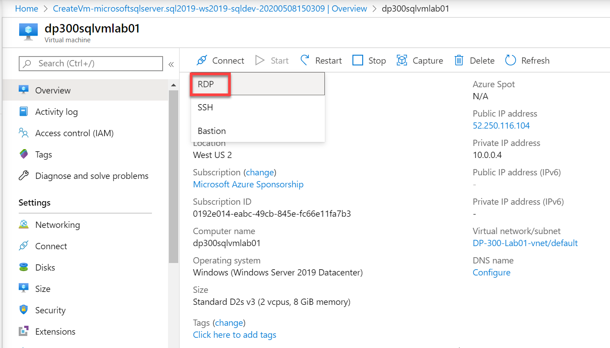
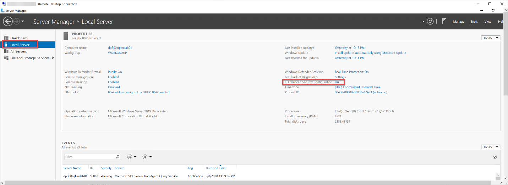
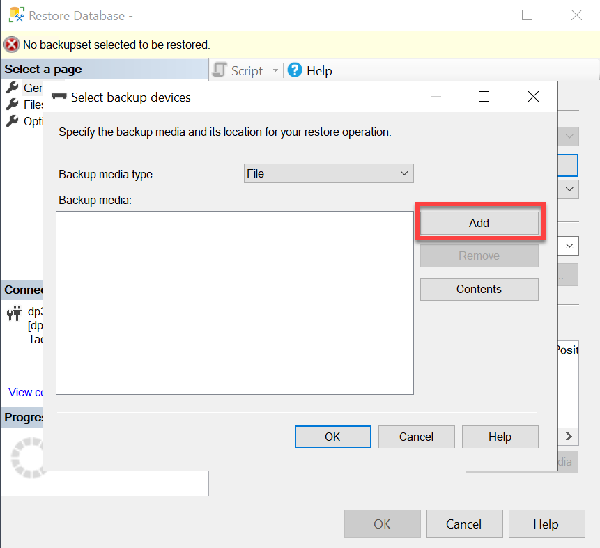
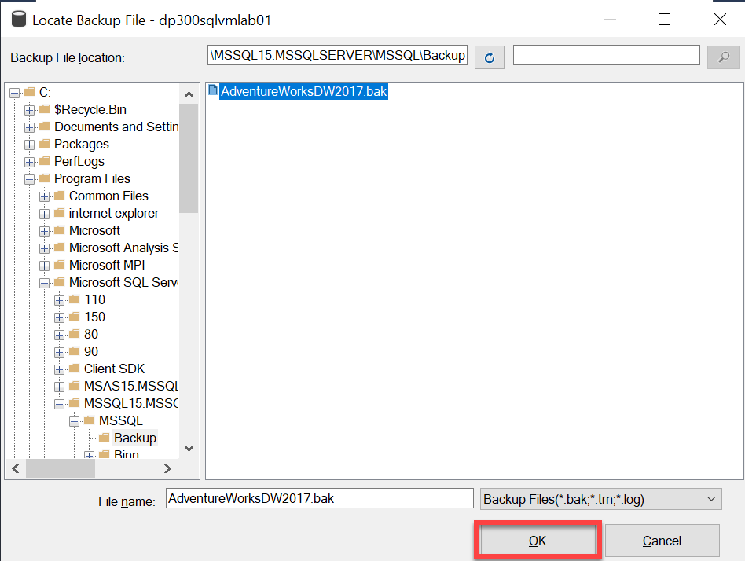
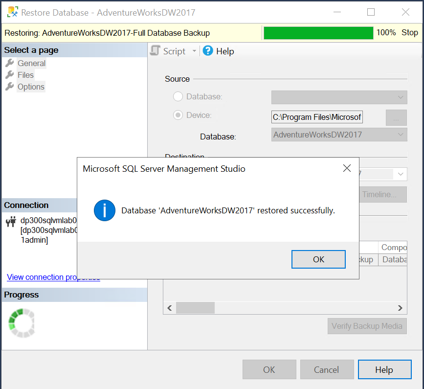

---
lab:
  title: 实验室 1 - 使用 Azure 门户和 SQL Server Management Studio
  module: The Role of the Azure Database Administrator
---


# <a name="lab-1---using-the-azure-portal-and-sql-server-management-studio"></a>实验室 1 - 使用 Azure 门户和 SQL Server Management Studio

预计时间：30 分钟

先决条件：无 

实验室文件：无

 

# <a name="lab-overview"></a>实验室概述 

Students will explore the Azure Portal and use it to create an Azure VM with SQL Server 2019 installed. Then they will connect to the virtual machine through Remote Desktop Protocol and restore a database using SQL Server Management Studio. 

# <a name="lab-goal"></a>实验室目标

The student will be able to interact with the Azure portal to create a SQL Server Virtual Machine. They should then be able to connect to the virtual machine and use SQL Server Management Studio to restore a database. 

# <a name="lab-objectives"></a>实验室目标

学生将学习以下内容：

- 与 Azure 门户进行交互

- 创建 SQL Server 虚拟机

- 使用 SQL Server Management Studio 还原数据库

# <a name="scenario"></a>方案

You are a database administrator for AdventureWorks. You need to create a test environment for use in a proof of concept. The proof of concept will use SQL Server on an Azure Virtual Machine and a backup of the AdventureWorksDW database. You need to set up the Virtual Machine, restore the database, and query it to ensure it is available. 

# <a name="exercise-1-provision-a-sql-server-on-an-azure-virtual-machine"></a>练习 1：在 Azure 虚拟机上预配 SQL Server

预计时间：**20 分钟**

本练习的主要任务如下： 

1. 浏览 Azure 门户并找到重要功能。

2. 使用 Azure 门户在 Azure 虚拟机上创建 SQL Server。

 

## <a name="task-1-explore-the-azure-portal"></a>任务 1：探索 Azure 门户

1. 在实验室虚拟机中（如果没有在门户中），启动浏览器会话并导航到 [https://portal.azure.com](https://portal.azure.com/)。 

    

 

2. In the Azure Portal, type subscription in the search bar at the top of the screen. Click on the subscriptions icon. (You may need to log in first.)

    

 

3. On the Subscriptions blade, you will have one or more subscriptions. Review your Subscription name, subscription ID, and your role. 

    

4. Launch the left navigation pane by clicking the horizontal lines next to Microsoft Azure in the top left of the portal. Then select All resources. 

    

    

 

5. “所有资源”页面将列出所选订阅中的所有 Azure 资源。 

 

6. 选择左侧导航中的“资源组”。

    

    

    “资源组”边栏选项卡将列出所选订阅中的所有 Azure 资源组。 


7. 在“资源组”边栏选项卡中，选择“创建”按钮。 

    

 
8. Ensure you have selected the appropriate subscription for the lab. Name the resource group DP-300-Lab01. Select the nearest Azure region to your location. Select the Review + Create button. Once the review completes, select the Create button. 

    

9. 学生将探索 Azure 门户，并使用它来创建一个安装了SQL Server 2019 的 Azure VM。

    

 

## <a name="task-2-provision-a-sql-server-on-an-azure-virtual-machine"></a>任务 2：在 Azure 虚拟机上预配 SQL Server

1. 在“Azure SQL”边栏选项卡上，选择“创建”按钮。 

    


2. 然后，他们将通过远程桌面协议连接到虚拟机，并使用 SQL Server Management Studio 还原数据库。
    
    

3. 在“创建虚拟机”边栏选项卡中，输入以下信息： 

    - 订阅：&lt;你的描述&gt;

    - 资源组：DP-300-Lab01

    - 虚拟机名称：dp300sqlvmlab01

    - 区域：&lt;你的本地区域，与你的资源组的选定区域相同&gt;

    - 可用性选项：无需基础结构冗余
    
    - 映像:免费 SQL Server 许可证：Windows Server 2019 上的 SQL 2019 Developer - Gen1

    - Azure Spot 实例：**否**

    - 大小：标准 D2s_v3（2 个 vCPU，8 GiB 内存；可能需要选择“查看所有大小”链接才能查看此选项）

    - 管理员帐户用户名：dp300sqlvmlab01admin

    - 管理员帐户密码：pwd!DP300lab01（或你自己的符合条件的密码）

    - 选择入站端口：RDP (3389)

    - 是否要使用现有的 Windows Server 许可证？：**否**

 

    记下用户名和密码以供日后使用。

    


4. 导航到“磁盘”选项卡，然后查看配置。 

    

 
5. 导航到“网络”选项卡，然后查看配置。 

    
 

6. 导航到“管理”选项卡，然后查看配置。 

    

    Make sure that <bpt id="p1">**</bpt>Boot diagnostics<ept id="p1">**</ept> has the button for <bpt id="p2">**</bpt>Enable with managed storage account (recommended)<ept id="p2">**</ept> selected. 
    Verify that <bpt id="p1">**</bpt>Enable auto_shutdown<ept id="p1">**</ept> is off. 


7. 导航到“高级”选项卡，然后查看配置。 

    


8. 导航到“SQL Server 设置”选项卡，然后查看配置。 

    

 

    Note—you can also configure the storage for your SQL Server VM on this screen. By default, the SQL Server Azure VM templates create one premium disk with read caching for data, one premium disk without caching for transaction log, and uses the local SSD (D:\ on Windows) for tempdb.


9. 学生将能够与 Azure 门户进行交互以创建 SQL Server 虚拟机。  
‎ 


10. 然后，他们应能够连接到虚拟机并使用 SQL Server Management Studio 还原数据库。 

    

 
11. 在虚拟机的概述页面上，滚动浏览资源的菜单选项，查看可用内容。

    


# <a name="exercise-2-connect-to-sql-server-and-restore-a-backup"></a>练习 2：连接到 SQL Server 并还原备份

预计时间：10 分钟

本练习的主要任务如下： 

1. 在 Azure 虚拟机上创建到 SQL Server 的 RDP（远程桌面协议）连接

2. 下载数据库备份文件。

3. 使用 SQL Server Management Studio 在 SQL Server 中还原数据库

4. 查询数据库以确认其可用性

 
## <a name="task-1-connect-to-the-virtual-machine-and-download-the-backup-file"></a>任务 1：连接到虚拟机并下载备份文件

1. 在虚拟机的“概述”页面上，选择“连接”按钮，然后选择“RDP”。 

    

 
2. 在“RDP”选项卡上，选择“下载 RDP 文件”按钮。 

    

3. Open the RDP file that was just downloaded. When a dialog appears asking if you want to connect, select the Connect button.   
‎   

 
4. In the Windows Security dialog if you receive the PIN dialog, select More choices. Then choose Use a different account. If you don’t receive the PIN dialog, you can proceed to Step 5.

    

 
5. Enter the username and password selected during the virtual machine provisioning process. Then select the OK button.

    

 
6. 当出现询问你是否要进行连接的“远程桌面连接”对话框时，选择“是”按钮。 

    


7. A Remote Desktop window will open. On the right, select the No button to indicate you do not want the computer to be discoverable by other devices on the network. Close the small Server Manager popup dialog by clicking the X in the top right of the box. Keep the big Server Manager Window open.

    

 
8. 在“服务器管理器”窗口中，选择左侧的“本地服务器”，然后选择“IE 增强的安全配置”旁边的“启用”。 

    

 
9. When the Internet Explorer Enhanced Security Configuration dialog appears, set Administrators to Off. Then select the OK button.

    

 
10. 选择任务栏中的图标以打开 Internet Explorer。 

    


11. 在 Internet Explorer 中，导航到以下 URL： 

    [https://github.com/Microsoft/sql-server-samples/releases/download/adventureworks/AdventureWorksDW2017.bak](https://github.com/Microsoft/sql-server-samples/releases/download/adventureworks/AdventureWorksDW2017.bak)

    

    将出现一个对话框，询问你是否要运行或保存文件。   
    ‎

 

12. 在对话框中，选择“保存”旁边的下拉菜单，然后选择“另存为”。 

    

 

13. 在“另存为”对话框中，导航到以下文件夹位置：   
C:\Program Files\Microsoft SQL Server\MSSQL15.MSSQLSERVER\MSSQL\Backup。  
‎ Leave the file name as AdventureWorksDW2017 and the type as BAK file. Select the Save button. 

    
 
## <a name="task-2-restore-the-database-and-verify-its-availability"></a>任务 2：还原数据库并验证其可用性

 

1. Select the Windows Start button and type SSMS. Select Microsoft SQL Server Management Studio 18 from the list.  
‎ 


2. 你是 AdventureWorks 的数据库管理员。 


    

 

3. 在对象资源管理器中，右键单击“数据库”节点，然后选择“还原数据库”。

    

 

4. 在“还原数据库”对话框中，在“源”下选择“设备”，然后选择标有省略号的设备右侧的按钮。 

    

 

5. 在“选择备份设备”对话框中，选择“添加”。 

    


6. 在“本地备份文件”对话框中，选择 AdventureWorksDW2017.bak，然后选择“确定”按钮。 

    

 
7. 你需要创建一个测试环境用于概念证明。

    


8. 概念证明将在 Azure 虚拟机上使用 SQL Server 和AdventureWorksDW 数据库的备份。 

    

 
9. 你需要设置虚拟机、还原数据库并对其进行查询以确保其可用。

    

 

10. In the Object Explorer, expand the Databases node, then expand the AdventureWorksDW2017 node, then expand the Tables node. Verify that the database contains several tables including dbo.DimAccount.

    

 
11. In Management Studio, select the AdventureWorksDW2017 node in the Object Explorer. Then select the New Query button. 

    


12. 将以下语句复制并粘贴到新建查询窗口中： 

    ```SQL
    SELECT CalendarYear, Sum(SalesAmount) SalesAmount 

    FROM dbo.FactInternetSales FS

    INNER JOIN dbo.DimDate DD ON FS.OrderDateKey = DD.DateKey

    GROUP BY CalendarYear
    ```

    


13. Select the Execute button execute the query. Verify that the sales amount for 2010 is <bpt id="p1">**</bpt>43421.0364<ept id="p1">**</ept>. 

    

 

 

## <a name="task-3-clean-up"></a>任务 3：清理

1. 退出远程桌面。 

2. Delete the VM you created in this lab to save costs. You will not be using it for subsequent labs. 

3. 导航到 dp300sqlvmlab01 虚拟机的主（概述）边栏选项卡，然后单击菜单中的“删除”按钮。 

    
 
4. 单击 **“确定”** 。
