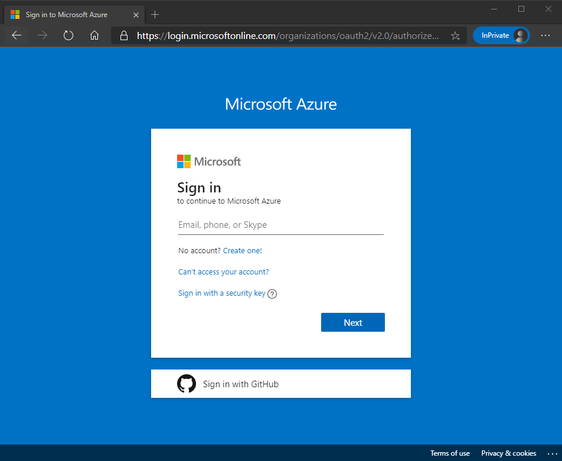
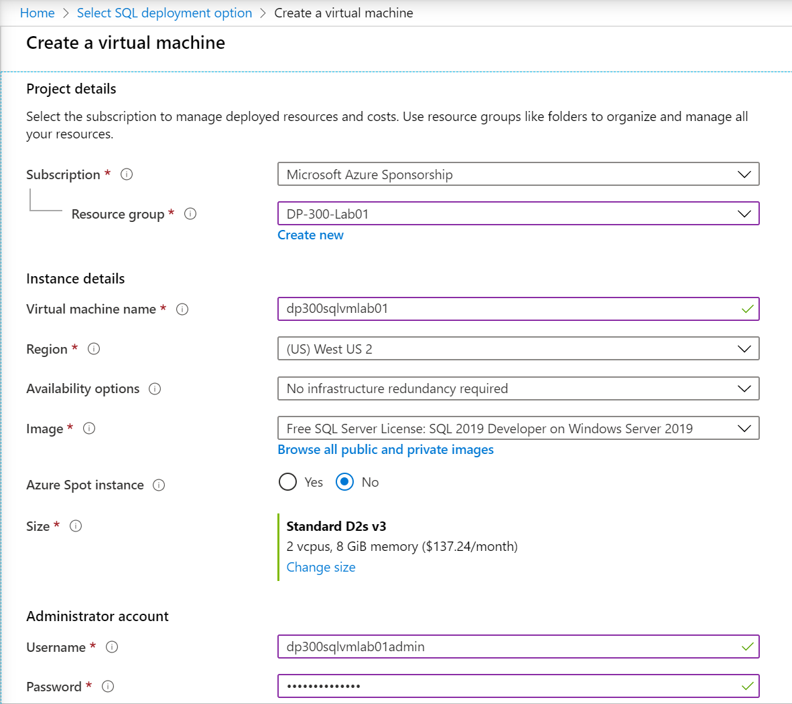
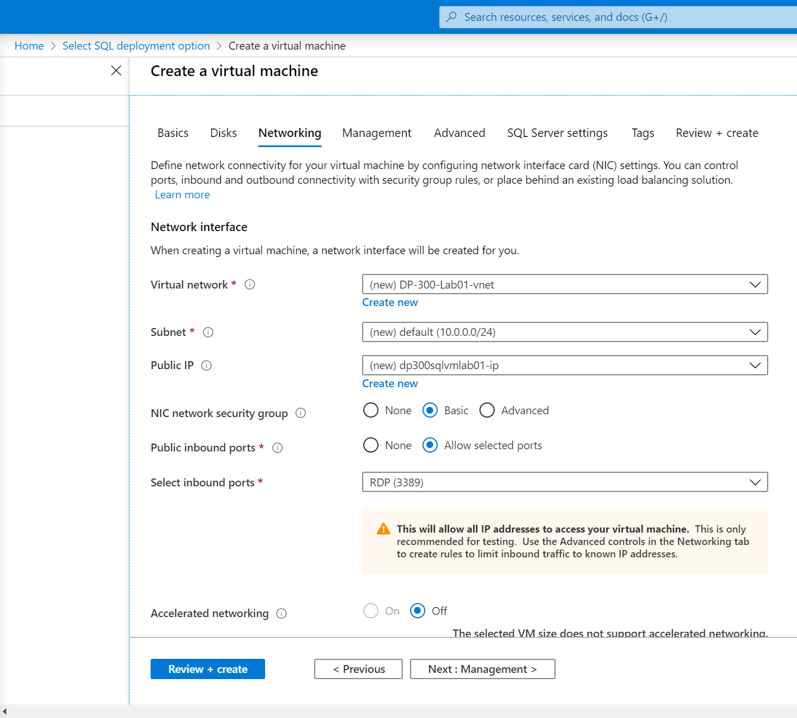
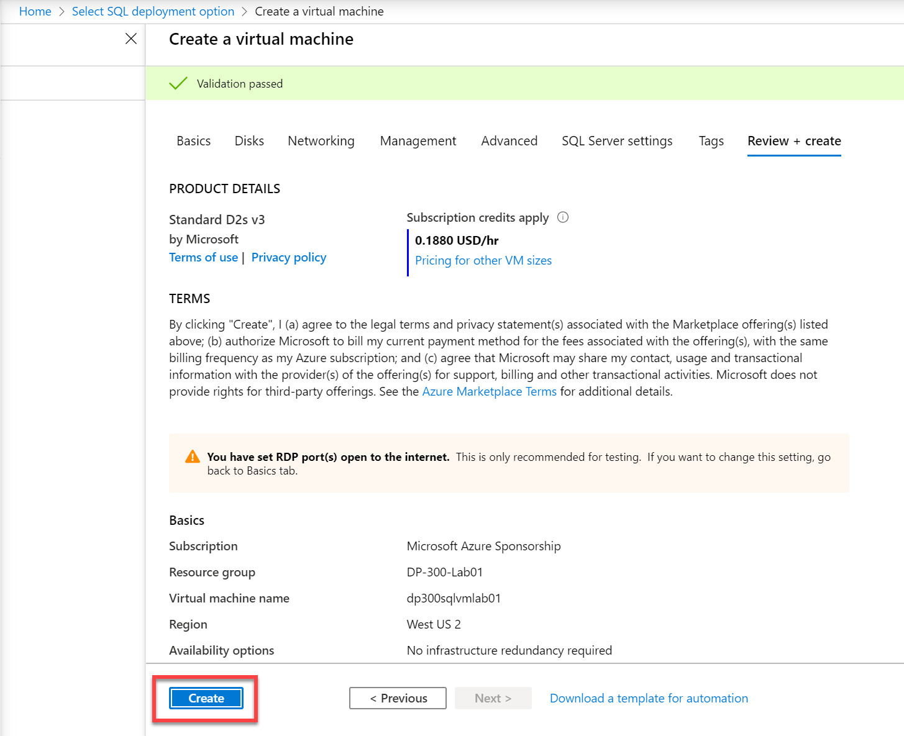
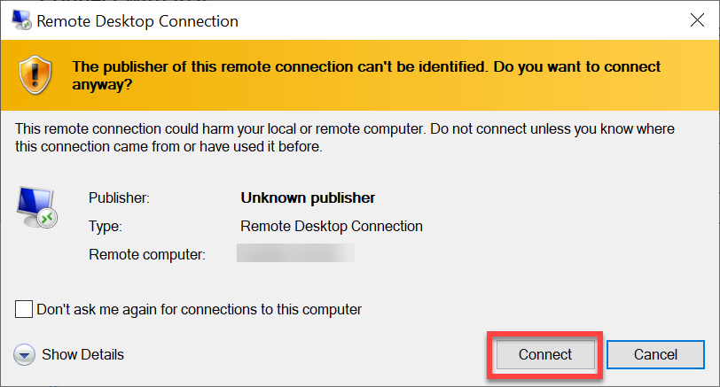
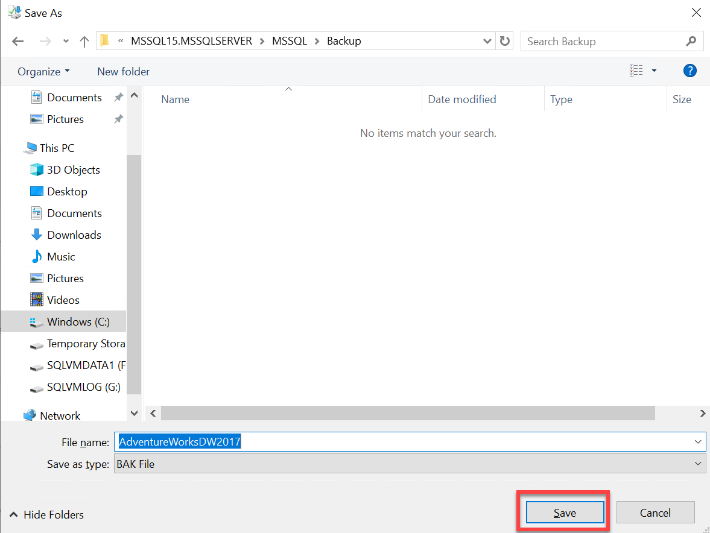
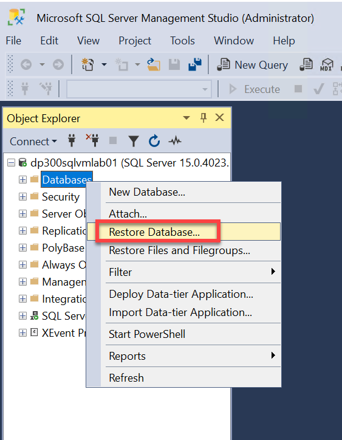

---
lab:
    title: '实验室 1 - 使用 Azure 门户和 SQL Server Management Studio'
    module: 'Azure 数据库管理员的角色'
---


# 实验室 1 - 使用 Azure 门户和 SQL Server Management Studio

**预计用时：30 分钟**

**先决条件：无** 

**实验室文件：无**

 

# 实验室概述 

学生将探索 Azure 门户，并使用它来创建一个安装了SQL Server 2019 的 Azure VM。然后，他们将通过远程桌面协议连接到虚拟机，并使用 SQL Server Management Studio 还原数据库。 

# 实验室目标

学生将能够与 Azure 门户进行交互以创建 SQL Server 虚拟机。然后，他们应能够连接到虚拟机并使用 SQL Server Management Studio 还原数据库。 

# 实验室目标

学生将学习以下内容：

- 与 Azure 门户进行交互

- 创建 SQL Server 虚拟机

- 使用 SQL Server Management Studio 还原数据库

# 应用室场景

你是 AdventureWorks 的数据库管理员。你需要创建一个用于概念证明的测试环境。概念证明将在 Azure 虚拟机上使用 SQL Server 和AdventureWorksDW 数据库的备份。你需要设置虚拟机、还原数据库并对其进行查询以确保其可用。 

# 练习 1：在 Azure 虚拟机上预配 SQL Server

**预计用时：20 分钟**

本次练习的主要任务如下： 

1. 浏览 Azure 门户并找到重要功能。

2. 使用 Azure 门户在 Azure 虚拟机上创建 SQL Server。

 

## 任务 1：探索 Azure 门户

1. 在实验室虚拟机中（如果还没有在门户中），启动浏览器会话并导航到 [https://portal.azure.com](https://portal.azure.com/). 

	

 

2. 在 Azure 门户屏幕顶部的搜索栏中键入订阅。单击订阅图标。（可能需要先登录。）

	

 

3. 在“订阅”边栏选项卡上，你将拥有一个或多个订阅。查看你的订阅名称、订阅 ID 和你的角色。 

	

4. 通过单击门户左上方 Microsoft Azure 旁边的水平线启动左侧导航窗格。然后选择“所有资源”。 

	

	

 

5. “所有资源”页面将列出所选订阅中的所有 Azure 资源。 

 

6. 选择左侧导航中的“资源组”。

	

	

	“资源组”边栏选项卡将列出所选订阅中的所有 Azure 资源组。 


7. 在“资源组”边栏选项卡中，选择“创建”按钮。 

	

 
8. 确保已为实验室选择适当的订阅。将资源组命名为 DP-300-Lab01。选择离你的位置最近的 Azure 区域。选择“查看 + 创建”按钮。查看结束后，选择“创建”按钮。 

	

9. 找到页面顶部的搜索栏。搜索 Azure SQL。选择出现在“服务”下结果中的 Azure SQL 搜索结果。

	

 

## 任务 2：在 Azure 虚拟机上预配 SQL Server

1. 在“Azure SQL”边栏选项卡上，选择“创建”按钮。 

	


2. 在“选择 SQL 部署选项”边栏选项卡上，打开 SQL 虚拟机下的下拉框。选择标记为“免费 SQL Server 许可证”的选项：Windows Server 2019 上的 SQL 2019 Developer。然后选择“创建”按钮。
	
	

3. 在“创建虚拟机”边栏选项卡中，输入以下信息： 

	- 订阅： **&lt;你的订阅&gt;**

	- 资源组： **DP-300-Lab01**

	- 虚拟机名称：  **中的机器人 dp300sqlvmlab01**

	- 区域： **&lt;your local region, same as the selected region for your resource group&gt;**

	- 可用性选项： **无需基础结构冗余**
	
	- 映像： **免费 SQL Server 许可证：Windows Server 2019 上的 SQL 2019 Developer - Gen1**

	- Azure Spot 实例： **否**

	- 大小：标准 **D2s_v3** （2 个 vCPU，8 GiB 内存；可能需要选择“查看所有大小”链接才能查看此选项）

	- 管理员帐户用户名： **dp300sqlvmlab01admin**

	- 管理员帐户密码： **pwd!DP300lab01** （或你自己的符合条件的密码）

	- 选定的入站端口： **RDP (3389)**

	- 是否要使用现有的 Windows Server 许可证？：**否**

 

	记下用户名和密码以供日后使用。

	


4. 导航到“磁盘”选项卡并查看配置。 

	

 
5. 导航到“网络”选项卡并查看配置。 

	
 

6. 导航到“管理”选项卡并查看配置。 

	

	确保 **“启动诊断”** 已选择 **“启用托管存储帐户（推荐）”** 按钮。 
	验证 **“启用 auto_shutdown”** 是否已关闭。 


7. 导航到“高级”选项卡并查看配置。 

	


8. 导航到“SQL Server 设置”选项卡并查看配置。 

	

 

	备注：还可在此屏幕上为 SQL Server VM 配置存储。默认情况下，SQL Server Azure VM 模板创建一个具有读取数据缓存的高级磁盘、一个不具有事务日志缓存的高级磁盘，并为 tempdb 使用本地 SSD（在 Windows上为 D:\）。


9. 选择“查看 + 创建”按钮。然后选择“创建”按钮。  
‎
    


10. 在“部署”边栏选项卡上，等待直到部署完成。部署 VM 大约需要 5-10 分钟。然后选择“转到资源”按钮。 

	

 
11. 在虚拟机的概述页面上，滚动浏览资源的菜单选项以查看可用资源。

	


# 练习 2：连接到 SQL Server 并还原备份

**预计用时：10 分钟**

本次练习的主要任务如下： 

1. 在 Azure 虚拟机上创建到 SQL Server 的 RDP（远程桌面协议）连接

2. 下载数据库备份文件。

3. 使用 SQL Server Management Studio 在 SQL Server 中还原数据库

4. 查询数据库以确认其可用性

 
## 任务 1：连接到虚拟机并下载备份文件

1. 在虚拟机的“概述”页面上，选择“连接”按钮，然后选择“RDP”。 

	

 
2. 在“RDP”选项卡上，选择“下载 RDP 文件”按钮。 

	

3. 打开刚刚下载的 RDP 文件。当出现询问是否要连接的对话框时，选择“连接”按钮。   


 
4. 在“Windows 安全性”对话框中，如果收到“PIN”对话框，请选择“更多选项”。然后选择“使用其他帐户”。如果未出现 PIN 对话框，则可继续执行步骤 5。

	

 
5. 输入在虚拟机预配过程中选择的用户名和密码。然后选择“确定”按钮。

	

 
6. 当出现询问你是否要进行连接的“远程桌面连接”对话框时，选择“是”按钮。 

	


7. 将打开“远程桌面”窗口。在右侧，选择“否”按钮以指示你不希望网络上的其他设备发现该计算机。单击小的“服务器管理器”弹出对话框右上角的 X 关闭该对话框。让大的“服务器管理器窗口”保持打开状态。

	

 
8. 在“服务器管理器”窗口中，选择左侧的“本地服务器”，然后选择“IE 增强的安全配置”旁边的“启用”。 

	

 
9. 出现“Internet Explorer 增强的安全配置”对话框时，将“管理员”设置为“禁用”。然后选择“确定”按钮。

	

 
10. 选择任务栏中的图标以打开 Internet Explorer。 

	


11. 在 Internet Explorer 中，导航到以下 URL： 

	[https://github.com/Microsoft/sql-server-samples/releases/download/adventureworks/AdventureWorksDW2017.bak](https://github.com/Microsoft/sql-server-samples/releases/download/adventureworks/AdventureWorksDW2017.bak)

	

	将出现一个对话框，询问你是否要运行或保存文件。   
	

 

12. 在对话框中，选择“保存”旁边的下拉菜单，然后选择“另存为”。 

	

 

13. 在“另存为”对话框中，导航到以下文件夹位置：   
C:\Program Files\Microsoft SQL Server\MSSQL15.MSSQLSERVER\MSSQL\Backup。  
将文件名保留为 AdventureWorksDW2017，并将类型保留为 BAK 文件。选择“保存”按钮。 

    
 
## 任务 2：还原数据库并验证其可用性

 

1. 选择 Windows 开始按钮，然后键入 SSMS。从列表中选择“Microsoft SQL Server Management Studio 18”。  
‎
	


2. 打开 Management Studio 后，“连接到服务器”对话框将被预填充到本地计算机。选择“连接”按钮。 


	

 

3. 在对象资源管理器中，右键单击“数据库”节点，然后选择“还原数据库”。

	

 

4. 在“还原数据库”对话框中，在“源”下选择“设备”，然后选择标有省略号的设备右侧的按钮。 

	

 

5. 在“选择备份设备”对话框中，选择“添加”。 

	


6. 在“本地备份文件”对话框中，选择 AdventureWorksDW2017.bak，然后选择“确定”按钮。 

	

 
7. 验证在“选择备份设备”对话框的“备份媒体”下现在是否列出了一项。然后选择“确定”按钮。

	


8. 验证在“还原数据库”对话框中的“备份集”下是否列出了要还原的一项。然后选择“确定”按钮。 

	

 
9. 数据库还原完成后，将出现一个对话框，显示消息“成功还原数据库 'AdventureWorksDW2017'”。选择“确定”按钮。

	

 

10. 在对象资源管理器中，依次展开“数据库”节点、“AdventureWorksDW2017”节点和“表”节点。验证数据库是否包含 dbo.DimAccount 在内的几个表。

	

 
11. 在 Management Studio 的对象资源管理器中选择“AdventureWorksDW2017”节点。然后选择“新建查询”按钮。 

	


12. 将以下语句复制并粘贴到新建查询窗口中： 

	```SQL
	SELECT CalendarYear, Sum(SalesAmount) SalesAmount 

	FROM dbo.FactInternetSales FS

	INNER JOIN dbo.DimDate DD ON FS.OrderDateKey = DD.DateKey

	GROUP BY CalendarYear
	```

	


13. 选择“执行”按钮以执行查询。验证 2010 年销售额是否为 **43421.0364**。 

	

 

 

## 任务 3：知识总结

1. 退出远程桌面。 

2. 删除在此实验室中创建的 VM 以节省成本。你将不会在后续实验室中使用它。 

3. 导航到 **dp300sqlvmlab01** 虚拟机的主（概述）边栏选项卡，然后单击菜单中的“删除”按钮。 

    
 
4. 单击 **“确定”**。
