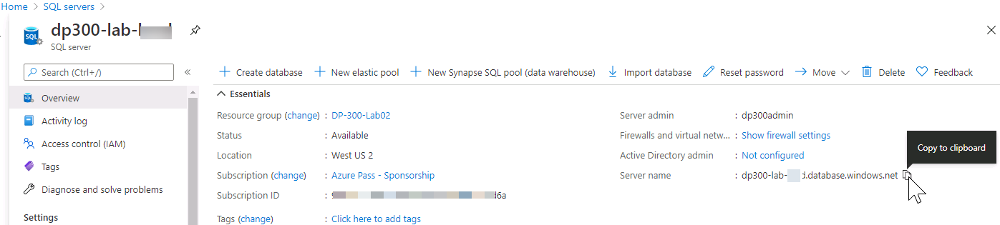
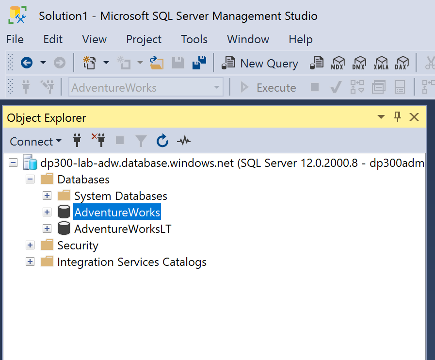
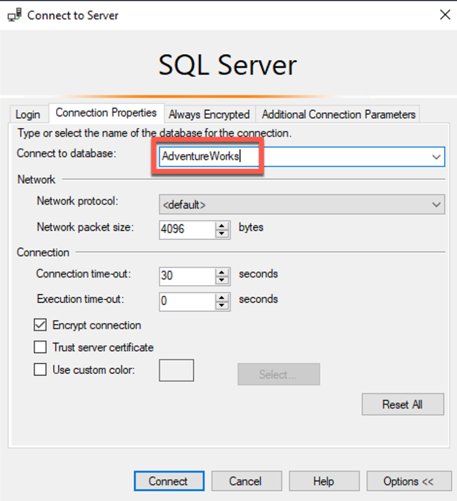
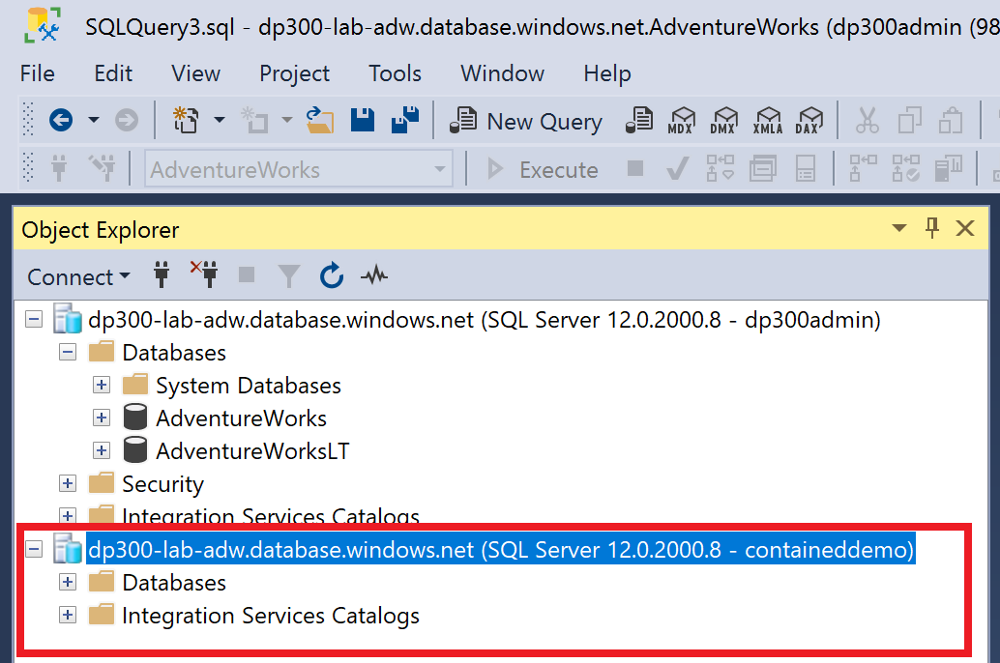
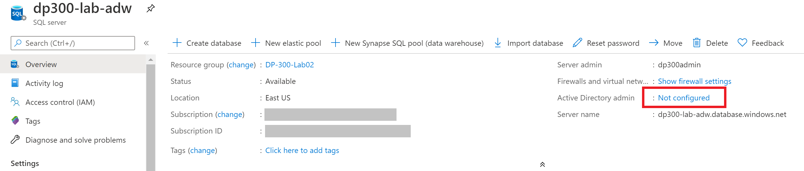
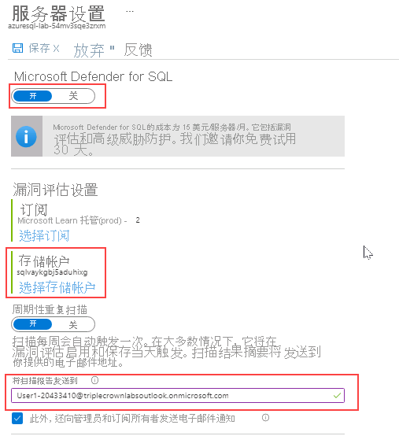

---
lab:
  title: 实验室 3 - 实现安全环境
  module: Implement a Secure Environment
---

# <a name="lab-3--implement-a-secure-environment"></a>实验室 3 - 实现安全环境
 

预计用时：60 分钟

<bpt id="p1">**</bpt>Prerequisites<ept id="p1">**</ept>: An Azure SQL server you created in the lab for Module 2. Azure Active Directory access in the subscription.  

实验室文件：此实验室的文件位于“D:\Labfiles\Secure Environment”文件夹中。

# <a name="lab-overview"></a>实验室概述

学生将利用从课程中获取的信息，在 Azure 门户和 AdventureWorks 数据库中进行配置，随后实现安全性。 

# <a name="lab-objectives"></a>实验室目标

完成本实验室后，你将能够：

1. 配置 Azure SQL 数据库防火墙

2. 通过 Azure Active Directory 授予对 Azure SQL 数据库的访问权限

3. 针对 Azure SQL 数据库启用 Microsoft Defender for SQL

4. 为 Azure SQL 数据库配置数据分类

5. 管理对数据库对象的访问权限

# <a name="scenario"></a>场景

You have been hired as a Senior Database Administrator help ensure the security of the database environment. These tasks will focus on Azure SQL Database. 

<bpt id="p1">**</bpt>Note:<ept id="p1">**</ept> The exercises ask you to copy and paste T-SQL code. Please verify that the code has been copied correctly, with the proper line breaks, before executing the code. 

## <a name="exercise-1-configure-an-azure-sql-database-firewall-and-connect-to-a-new-database"></a>练习 1：配置 Azure SQL 数据库防火墙并连接到新数据库

1. From the lab virtual machine, start a browser session and navigate to <bpt id="p1">[</bpt><ph id="ph1">https://portal.azure.com</ph><ept id="p1">](https://portal.azure.com/)</ept>. Provide appropriate credentials. 

    

2. **先决条件**：在实验室中为模块 2 创建的 Azure SQL 服务器。

    

3. 在 SQL Server 的详细信息屏幕中，将鼠标移到服务器名称右侧，然后单击“复制到剪贴板”按钮，如下所示。

    

4. 订阅中的 Azure Active Directory 访问。

    

    This will allow you to connect to your Azure SQL Database server using SQL Server Management Studio or any other client tools. <bpt id="p1">**</bpt>Important:<ept id="p1">**</ept> Make note of your client IP address, you will use it later in this task.

5. Open SQL Server Management Studio on the lab VM. Paste in the name of your Azure SQL database server and login with the credentials you created in Lab 2:

    - 服务器名称：&lt;在此处粘贴你的 Azure SQL 数据库服务器名称&gt; 
         
     - 身份验证：**SQL Server 身份验证**  
    
    - 服务器管理员登录名：dp300admin

    - Password：dp300P@ssword!

    

    单击“连接”  。

6. In Object Explorer expand the server node, and right click on databases. Click Import a Data-tier Application.

    

7. 在“导入数据层应用程序”对话框中，点击第一个屏幕中的“下一步”。 

    

8. In the Import Settings screen, click Browse and navigate to D:\Labfiles\Secure Environment folder and click on the AdventureWorks.bacpac file and click open. Then in the Import Data-tier application screen click <bpt id="p1">**</bpt>Next<ept id="p1">**</ept>.

    

    

9. On the database settings screen, change the edition of Azure SQL Database to General Purpose. Change the Service Objective to <bpt id="p1">**</bpt>GP_Gen5_2<ept id="p1">**</ept> and click <bpt id="p2">**</bpt>Next<ept id="p2">**</ept>. 

    

10.  On the Summary screen click <bpt id="p1">**</bpt>Finish<ept id="p1">**</ept>. When your import completes you will see the results below. Then click <bpt id="p1">**</bpt>Close<ept id="p1">**</ept><ph id="ph1">
    </ph><ph id="ph2"></ph>

11. In Object Explorer, expand the Databases folder. Then right-click on AdventureWorks and click on new query. 

    

12. Execute the following T-SQL query by pasting the text into your query window. <bpt id="p1">**</bpt>Important:<ept id="p1">**</ept> Replace 192.168.1.1. with your client IP address from Step 4. Click execute or press F5.

    ```sql
    EXECUTE sp_set_database_firewall_rule @name = N'ContosoFirewallRule',

    @start_ip_address = '192.168.1.1', @end_ip_address = '192.168.1.1'
    ```

13. Next you will create a contained user in the AdventureWorks database. Click New Query and execute the following T-SQL. Ensure that you are still using the AdventureWorks database. If you see master in the database name box below, you can pull down and switch to AdventureWorks.

    ```sql
    CREATE USER containeddemo WITH PASSWORD = 'P@ssw0rd!'
    ```
    
    
    Click <bpt id="p1">**</bpt>Execute<ept id="p1">**</ept> to run this command. This command creates a contained user within the AdventureWorks database. You will login using the username and password in the next step.
    
14. Navigate to the Object Explorer. Click on <bpt id="p1">**</bpt>Connect<ept id="p1">**</ept> and then <bpt id="p2">**</bpt>Database Engine<ept id="p2">**</ept>.

    

15. Attempt to connect with the credentials you created in step 13. 
    You will need to use the following information:  
    -  登录名：containeddemo   
    -  密码：P@ssw0rd! 
     
     单击“连接”  。
     
     将看到以下错误。

    

    你已被聘为高级数据库管理员，帮助确保数据库环境的安全。

    

16. 这些任务侧重于 Azure SQL 数据库。

    

17. 另一个数据库应该出现在对象资源管理器中。 

    

    Make sure the selection stays on the newly added database. Then click <bpt id="p1">**</bpt>Connect<ept id="p1">**</ept> from the Object Explorer and <bpt id="p2">**</bpt>Database Engine<ept id="p2">**</ept>. 
    Enter the following again: 
    - 登录名：containeddemo   
    - 密码：P@ssw0rd! 

    单击“连接”  。

    这次，连接将绕过 master 数据库，并直接登录到 AdventureWorks，这是新创建的用户可以访问的唯一数据库。

## <a name="exercise-2-authorize-access-to-azure-sql-database-with-azure-active-directory"></a>练习 2：使用 Azure Active Directory 授权对 Azure SQL 数据库的访问

1. 导航到 Azure 门户，然后在屏幕右上角单击你的用户名。

    

    记下该用户名。 
    
    **注意：** 练习让你复制并粘贴 T-SQL 代码。

2. 在 Azure 门户中，导航到 Azure SQL 数据库服务器 dp300-lab-xx，然后单击“Active Directory 管理员”旁边的“未配置” 。

    

    在下一个屏幕上，单击“设置管理员”。

    

3. 请在执行代码前，验证代码是否正确复制并具有恰当的换行符。

    

4. Open SQL Server Management Studio and click <bpt id="p1">**</bpt>Connect<ept id="p1">**</ept>, then <bpt id="p2">**</bpt>Database Engine<ept id="p2">**</ept>. In the server name enter the name of your server. Change the authentication type to Azure Active Directory Universal with MFA.

    

    按提示输入 Azure Active Directory 密码，然后单击“连接”登录数据库。 

## <a name="exercise-3-enable-microsoft-defender-for-sql-and-data-classification"></a>练习 3：启用 Microsoft Defender for SQL 和数据分类

1. 在 Azure SQL server 的主边栏选项卡中，导航到“安全”部分，并选择“Microsoft Defender for Cloud”。

    

    如果未启用此选项，请在“Microsoft Defender for Cloud”页面上选择“启用 Microsoft Defender for SQL” 。

2. After Azure Defender for SQL is successfully enabled, select <bpt id="p1">**</bpt>Configure<ept id="p1">**</ept> option. You may need to refresh the page to see this option.

    

3. 在实验室虚拟机中，启动浏览器会话并导航到 [https://portal.azure.com](https://portal.azure.com/)。

    

4. 向下滚动 Azure SQL server 的“概述”屏幕，导航到 Azure 门户中的 AdventureWorksLT 数据库，然后选择“数据库名称”。

    

5. 导航到 Azure SQL 数据库主边栏选项卡的“安全性”部分，并选择“数据分类和发现”。

    

6. 提供适当的凭据。

    

7. 在下一个“数据发现和分类”屏幕中，选中“全选”旁的复选框，然后选择“接受所选建议”，最后选择“保存”以将分类保存到数据库中。

    

## <a name="exercise-4-manage-access-to-database-objects"></a>练习 4：管理对数据库对象的访问权限

1. In this exercise, you will manage access to the database and its objects. Navigate back to SQL Server Management Studio. The first thing you will do is create two users in the AdventureWorks database. 

    In the Object Explorer, right click on the AdventureWorks database and select <bpt id="p1">**</bpt>New Query<ept id="p1">**</ept>. In the new query window, copy and paste the following T-SQL into it. Verify that the code has been copied correctly. 

```sql
CREATE USER [DP300User1] WITH PASSWORD = 'Azur3Pa$$'

GO

CREATE USER [DP300User2] WITH PASSWORD = 'Azur3Pa$$'

GO
```

在 Azure 门户顶部的搜索栏中，键入 SQL。

2. 将显示 SQL 服务器图标。 

```sql
CREATE ROLE [SalesReader]

GO

ALTER ROLE [SalesReader] ADD MEMBER [DP300User1]

GO

ALTER ROLE [SalesReader] ADD MEMBER [DP300User2]

GO
```

3. 单击 SQL 服务器。

```sql
GRANT SELECT, EXECUTE ON SCHEMA::Sales TO [SalesReader]

GO
```
 

4. 单击服务器名称，前往你在实验室 2 中创建的服务器的详细信息页面

```sql
CREATE OR ALTER PROCEDURE Sales.DemoProc

AS

SELECT P.Name, Sum(SOD.LineTotal) as TotalSales ,SOH.OrderDate 

FROM Production.Product P

INNER JOIN Sales.SalesOrderDetail SOD on SOD.ProductID = P.ProductID

INNER JOIN Sales.SalesOrderHeader SOH on SOH.SalesOrderID = SOD.SalesOrderID

GROUP BY P.Name, SOH.OrderDate

ORDER BY TotalSales DESC

GO
```
 

5. Next you will use the EXECUTE AS USER command to test out the security you just created. This allows the database engine to execute a query in the context of your user. Clear the window of the previous query. Execute the below query in your query window.

```sql
EXECUTE AS USER = 'DP300User1'


SELECT P.Name, Sum(SOD.LineTotal) as TotalSales ,SOH.OrderDate 

FROM Production.Product P

INNER JOIN Sales.SalesOrderDetail SOD on SOD.ProductID = P.ProductID

INNER JOIN Sales.SalesOrderHeader SOH on SOH.SalesOrderID = SOD.SalesOrderID

GROUP BY P.Name, SOH.OrderDate

ORDER BY TotalSales DESC
```
 

This query will fail, with an error message saying the SELECT permission was denied on the Production.Product table. The role that user DP300User1 is a member of has SELECT permission in the Sales schema, but not in the Production schema. 

However, if you execute the stored procedure in that same context, the query will complete. Clear the query that gave an error message. Then execute the following T-SQL.

```sql
EXECUTE AS USER = 'DP300User1'

EXECUTE Sales.DemoProc
```

This happens because stored procedures take advantage a feature called ownership chaining to provide data access to users who do not have direct permissions to access database objects. For all objects that have the same owner, the database engine only checks the EXECUTE permission on the procedure and not the underlying objects. 

请不要删除本实验室中创建的任何资源，因为它们将在后续的实验室练习中使用。
