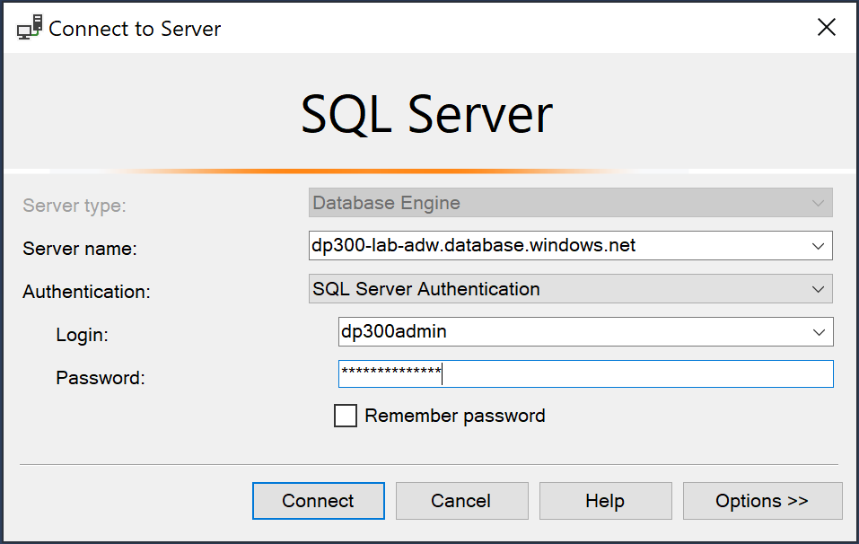
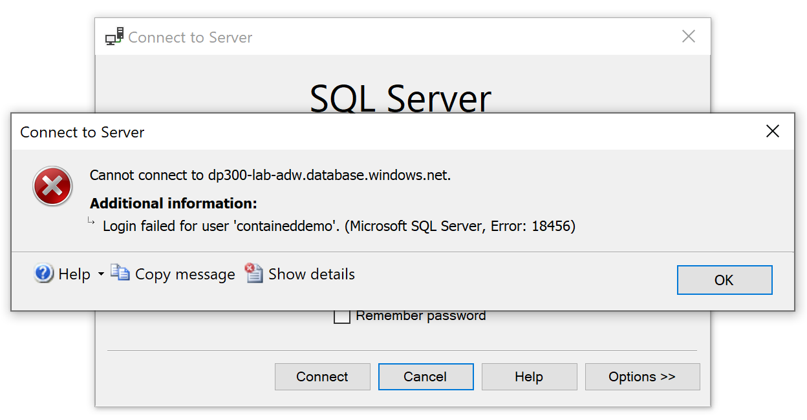
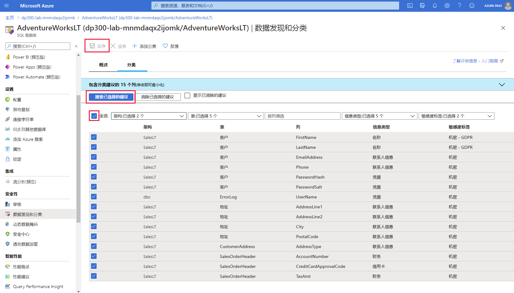

---
lab:
  title: 实验室 3 - 实现安全环境
  module: Implement a Secure Environment
---

# <a name="lab-3--implement-a-secure-environment"></a>实验室 3 - 实现安全环境
 

预计用时：60 分钟

**先决条件**：在实验室中为模块 2 创建的 Azure SQL 服务器。 订阅中的 Azure Active Directory 访问。  

实验室文件：此实验室的文件位于“D:\Labfiles\Secure Environment”文件夹中。

# <a name="lab-overview"></a>实验室概述

学生将利用从课程中获取的信息，在 Azure 门户和 AdventureWorks 数据库中进行配置，随后实现安全性。 

# <a name="lab-objectives"></a>实验室目标

完成本实验室后，你将能够：

1. 配置 Azure SQL 数据库防火墙

2. 通过 Azure Active Directory 授予对 Azure SQL 数据库的访问权限

3. 针对 Azure SQL 数据库启用 Microsoft Defender for SQL

4. 为 Azure SQL 数据库配置数据分类

5. 管理对数据库对象的访问权限

# <a name="scenario"></a>场景

你已被聘为高级数据库管理员，帮助确保数据库环境的安全。 这些任务侧重于 Azure SQL 数据库。 

**注意：** 练习让你复制并粘贴 T-SQL 代码。 请在执行代码前，验证代码是否正确复制并具有恰当的换行符。 

## <a name="exercise-1-configure-an-azure-sql-database-firewall-and-connect-to-a-new-database"></a>练习 1：配置 Azure SQL 数据库防火墙并连接到新数据库

1. 在实验室虚拟机中，启动浏览器会话并导航到 [https://portal.azure.com](https://portal.azure.com/)。 提供适当的凭据。 

    

2. 在 Azure 门户顶部的搜索栏中，键入 SQL。 将显示 SQL 服务器图标。 单击 SQL 服务器。 单击服务器名称，前往你在实验室 2 中创建的服务器的详细信息页面

    

3. 在 SQL Server 的详细信息屏幕中，将鼠标移到服务器名称右侧，然后单击“复制到剪贴板”按钮，如下所示。

    

4. 单击“显示防火墙设置”（在你刚复制的服务器名称上方）。 单击下面突出显示的“+ 添加客户端 IP”，然后单击“保存”。

    

    这将你能够使用 SQL Server Management Studio 或任何其他客户端工具连接到 Azure SQL 数据库服务器。 **重要提示：** 记下你的客户端 IP 地址，稍后将在此任务中使用它。

5. 在实验室 VM 上打开 SQL Server Management Studio。 粘贴你的 Azure SQL 数据库服务器名称，并使用在实验室 2 中创建的凭据登录：

    - 服务器名称：&lt;在此处粘贴你的 Azure SQL 数据库服务器名称&gt; 
         
     - 身份验证：**SQL Server 身份验证**  
    
    - 服务器管理员登录名：dp300admin

    - Password：dp300P@ssword!

    

    单击“连接”  。

6. 在“对象资源管理器”中，展开服务器节点，然后右键单击数据库。 单击“导入数据层应用程序”。

    

7. 在“导入数据层应用程序”对话框中，点击第一个屏幕中的“下一步”。 

    

8. 在“导入设置”屏幕中，单击“浏览”并导航到“D:\Labfiles\Secure Environment”文件夹，再单击 AdventureWorks.bacpac 文件，然后单击“打开”。 然后在“导入数据层应用程序”屏幕中，单击“下一步”。

    

    

9. 在数据库设置屏幕上，将 Azure SQL 数据库的版本更改为“常规用途”。 将“服务目标”更改为 GP_Gen5_2，然后单击“下一步” 。 

    

10.  在“摘要”屏幕中，单击“完成”。 导入完成后，你将看到以下结果。 然后单击“关闭”
    

11. 在对象资源管理器中，展开“数据库”文件夹。 然后右键单击 AdventureWorks，然后单击“新建查询”。 

    

12. 通过将文本粘贴到查询窗口中来执行以下 T-SQL 查询。 **重要提示：** 将 192.168.1.1. 替换为 步骤 4 中的客户端 IP 地址。 单击“执行”或按 F5。

    ```sql
    EXECUTE sp_set_database_firewall_rule @name = N'ContosoFirewallRule',

    @start_ip_address = '192.168.1.1', @end_ip_address = '192.168.1.1'
    ```

13. 接下来，将在 AdventureWorks 数据库中创建一个包含用户。 单击“新建查询”，然后执行以下 T-SQL。 确保仍在使用 AdventureWorks 数据库。 如果在下面数据库名称框中看到主实例，则可以下拉并切换到 AdventureWorks。

    ```sql
    CREATE USER containeddemo WITH PASSWORD = 'P@ssw0rd!'
    ```
    
    
    单击“执行”以运行此命令。 此命令会在 AdventureWorks 数据库中创建一个包含的用户。 将在下一步中使用此用户名和密码登录。
    
14. 导航到“对象资源管理器”。 依次单击“连接”、“数据库引擎” 。

    

15. 尝试使用步骤 13 创建的凭据建立连接。 
    你将需要使用以下信息：  
    -  登录名：containeddemo   
    -  密码：P@ssw0rd! 
     
     单击“连接”  。
     
     将看到以下错误。

    

    生成此错误是因为该连接尝试登录 master 数据库，而不是创建用户的 AdventureWorks。 若要更改连接上下文，请单击“确定”退出错误消息，然后单击“连接到服务器”对话框中的“选项 >>”，如下所示 。

    

16. 在“连接选项”选项卡上，键入数据库名称“AdventureWorks”。 单击“连接”  。

    

17. 另一个数据库应该出现在对象资源管理器中。 

    

    确保选择保留在新添加的数据库上。 然后从“对象资源管理器”和“数据库引擎”中单击“连接” 。 
    再次输入以下内容： 
    - 登录名：containeddemo   
    - 密码：P@ssw0rd! 

    单击“连接”  。

    这次，连接将绕过 master 数据库，并直接登录到 AdventureWorks，这是新创建的用户可以访问的唯一数据库。

## <a name="exercise-2-authorize-access-to-azure-sql-database-with-azure-active-directory"></a>练习 2：使用 Azure Active Directory 授权对 Azure SQL 数据库的访问

1. 导航到 Azure 门户，然后在屏幕右上角单击你的用户名。

    

    记下该用户名。 
    
    **重要提示：** Azure SQL 数据库的 Azure Active Directory 管理员不支持 Microsoft 帐户（例如 Outlook、Gmail、Hotmail 或 Yahoo 的用户帐户）。 你可以使用一种变通方法，即创建一个名为 DBA 的 Azure Active Directory 组，然后将你的用户帐户添加到其中。 或者，你可以跳过练习 2。

2. 在 Azure 门户中，导航到 Azure SQL 数据库服务器 dp300-lab-xx，然后单击“Active Directory 管理员”旁边的“未配置” 。

    

    在下一个屏幕上，单击“设置管理员”。

    

3. 在“设置管理员”屏幕中，搜索你的用户名。 找到后，单击以突出显示该用户名，然后单击“选择”。 你将返回到上面的“Active Directory 管理员”屏幕。 单击“保存”完成该过程。 这样，你的用户名将成为服务器的 Azure Active Directory 管理员，如下所示

    

4. 打开 SQL Server Management Studio，然后依次单击“连接”、“数据库引擎” 。 在“服务器名称”中，输入你的服务器名称。 将身份验证类型更改为“Azure Active Directory - 使用 MFA 进行通用身份验证”。

    

    按提示输入 Azure Active Directory 密码，然后单击“连接”登录数据库。 

## <a name="exercise-3-enable-microsoft-defender-for-sql-and-data-classification"></a>练习 3：启用 Microsoft Defender for SQL 和数据分类

1. 在 Azure SQL server 的主边栏选项卡中，导航到“安全”部分，并选择“Microsoft Defender for Cloud”。

    

    如果未启用此选项，请在“Microsoft Defender for Cloud”页面上选择“启用 Microsoft Defender for SQL” 。

2. 在成功启用 Azure Defender for SQL 后，请选择“配置”选项。 可能需要刷新页面，以查看此选项。

    

3. 在“服务器设置”页面上，确保“MICROSOFT DEFENDER FOR SQL”下的切换开关设置为“开”，并且提供“存储帐户”名称。 在“发送扫描报告到”中输入 Azure 帐户电子邮件，然后选择“保存”。

    

4. 向下滚动 Azure SQL server 的“概述”屏幕，导航到 Azure 门户中的 AdventureWorksLT 数据库，然后选择“数据库名称”。

    

5. 导航到 Azure SQL 数据库主边栏选项卡的“安全性”部分，并选择“数据分类和发现”。

    

6. 在“数据发现和分类”屏幕上，你会看见一条信息性消息：“我们发现了 15 列分类建议”。 选择该链接。

    

7. 在下一个“数据发现和分类”屏幕中，选中“全选”旁的复选框，然后选择“接受所选建议”，最后选择“保存”以将分类保存到数据库中。

    

## <a name="exercise-4-manage-access-to-database-objects"></a>练习 4：管理对数据库对象的访问权限

1. 在此练习中，你将管理对数据库及其对象的访问。 导航回到 SQL Server Management Studio。 首先，在 AdventureWorks 数据库中创建两个用户。 

    在“对象资源管理器”中，右键单击 AdventureWorks 数据库，然后选择“新建查询”。 在新建查询窗口中，将以下 T-SQL 复制并粘贴到其中。 验证是否已正确复制代码。 

```sql
CREATE USER [DP300User1] WITH PASSWORD = 'Azur3Pa$$'

GO

CREATE USER [DP300User2] WITH PASSWORD = 'Azur3Pa$$'

GO
```

你会注意到这些用户是在数据库范围内创建的。 因此，如果尝试使用其中一个用户登录，则需要在连接字符串中指定 AdventureWorks 数据库。

2. 接下来，你将创建一个自定义角色并将用户添加到其中。 在与步骤 1 相同的查询窗口中执行以下 T-SQL。 单击“执行”以运行。 

```sql
CREATE ROLE [SalesReader]

GO

ALTER ROLE [SalesReader] ADD MEMBER [DP300User1]

GO

ALTER ROLE [SalesReader] ADD MEMBER [DP300User2]

GO
```

3. 下一步是为该角色授予权限。 在本例中，要为 Sales 架构分配 SELECT 和 EXECUTE。 清除上一个查询的窗口。 然后在同一窗口中，单击“执行”以运行以下 T-SQL。从而授予角色权限。

```sql
GRANT SELECT, EXECUTE ON SCHEMA::Sales TO [SalesReader]

GO
```
 

4. 接下来，将在 Sales 架构中创建一个新的存储过程。 你会注意到此过程会访问 Product 架构中的一个表。 清除上一个查询的窗口。 在查询窗口中执行以下 T-SQL。

```sql
CREATE OR ALTER PROCEDURE Sales.DemoProc

AS

SELECT P.Name, Sum(SOD.LineTotal) as TotalSales ,SOH.OrderDate 

FROM Production.Product P

INNER JOIN Sales.SalesOrderDetail SOD on SOD.ProductID = P.ProductID

INNER JOIN Sales.SalesOrderHeader SOH on SOH.SalesOrderID = SOD.SalesOrderID

GROUP BY P.Name, SOH.OrderDate

ORDER BY TotalSales DESC

GO
```
 

5. 接下来，将使用 EXECUTE AS USER 命令测试刚刚建立的安全性。 这允许数据库引擎在用户的上下文中执行查询。 清除上一个查询的窗口。 在查询窗口中执行以下查询。

```sql
EXECUTE AS USER = 'DP300User1'


SELECT P.Name, Sum(SOD.LineTotal) as TotalSales ,SOH.OrderDate 

FROM Production.Product P

INNER JOIN Sales.SalesOrderDetail SOD on SOD.ProductID = P.ProductID

INNER JOIN Sales.SalesOrderHeader SOH on SOH.SalesOrderID = SOD.SalesOrderID

GROUP BY P.Name, SOH.OrderDate

ORDER BY TotalSales DESC
```
 

该查询将失败，并显示一条错误消息，提示对 Production.Product 表的 SELECT 权限遭到拒绝。 用户 DP300User1 所属的角色在 Sales 架构中具有 SELECT 权限，但在 Production 架构中则不具有此权限。 

但是，如果在相同的上下文中执行存储过程，查询将完成。 清除给出错误消息的查询。 然后执行以下 T-SQL。

```sql
EXECUTE AS USER = 'DP300User1'

EXECUTE Sales.DemoProc
```

这是因为存储过程利用了一种称为“所有权链接”的功能，向没有数据库对象直接访问权限的用户提供数据访问权限。 对于属于同一所有者的所有对象，数据库引擎仅检查过程的 EXECUTE 权限，而不检查基础对象的这一权限。 

请不要删除本实验室中创建的任何资源，因为它们将在后续的实验室练习中使用。
