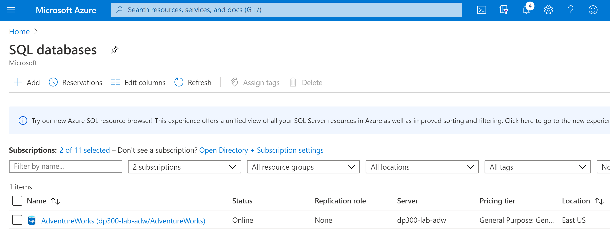
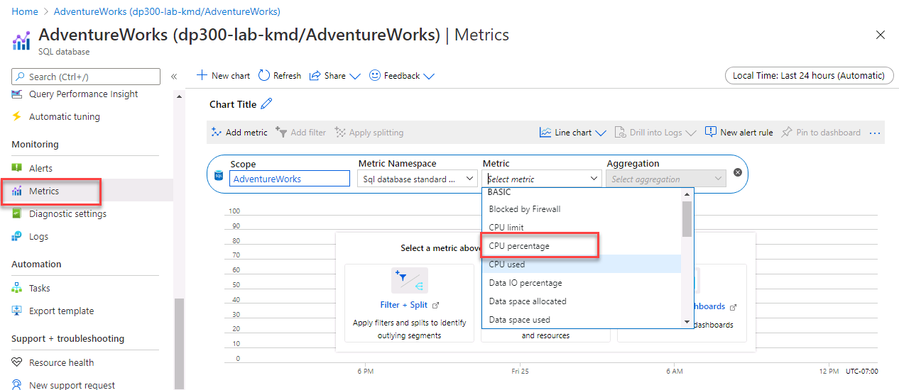
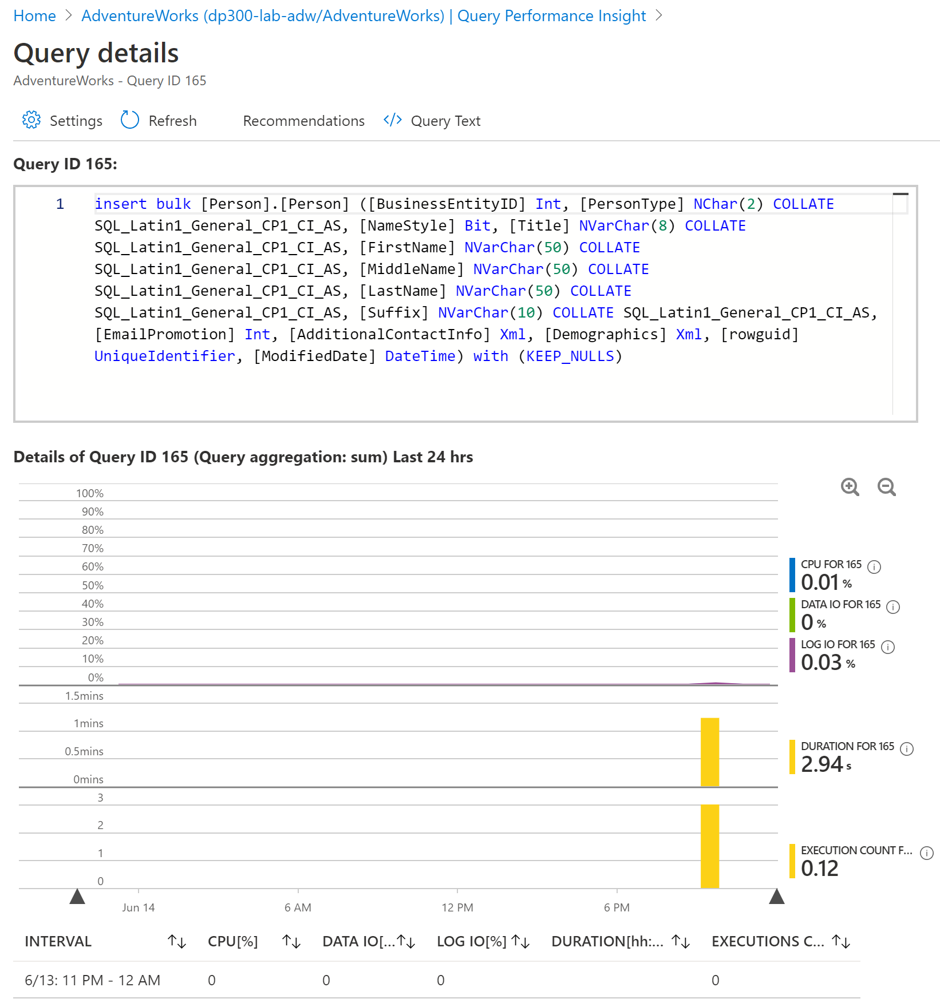

---
lab:
  title: 实验 4 – 监视和优化资源
  module: Monitor and Optimize Operational Resources
---

# <a name="lab-4--monitor-and-optimize-resources"></a>实验 4 – 监视和优化资源


预计用时：60 分钟

先决条件：在实验室 2 和 3 中创建的实验室 VM 和 Azure SQL 数据库


# <a name="lab-overview"></a>实验室概述


The students will take the information gained in the lessons to scope out the deliverables for a digital transformation project within AdventureWorks. Examining the Azure portal as well as other tools, students will determine how to utilize native tools to identify and resolve performance related issues. Finally, students will be able to identify fragmentation within the database as well as learn steps to resolve the issue appropriately. 


# <a name="lab-objectives"></a>实验室目标


完成本实验室后，你将能够：

1. 通过监视找出性能问题。 

2. 通过创建一个新的索引，利用查询存储来定位和解决阻塞问题

3. 检测并纠正碎片问题。 


# <a name="scenario"></a>方案


You have been hired as a database administrator to identify performance related issues and provide viable solutions to resolve any issues found. AdventureWorks has been selling bicycles and bicycle parts directly to consumers and distributors for over a decade. The company utilizes a mixture of both Azure SQL Databases as well as a SQL Server in an Azure Virtual Machine. Recently the company has noticed performance degradation within both products that are used to service customer requests. You need to use the Azure portal as well as on-premises tools to identify the performance issues and suggest methods to resolve them. 
 
        

<bpt id="p1">**</bpt>Note:<ept id="p1">**</ept> The exercises ask you to copy and paste T-SQL code. Please verify that the code has been copied correctly, with the proper line breaks, before executing the code. 

        

# <a name="exercise-1-isolate-problems-by-monitoring"></a>练习 1：通过监控隔离问题


预计时间：30 分钟

本练习的主要任务如下：

1. 查看监视解决方案以识别与 Azure SQL 数据库性能相关的问题

2. 使用查询存储可识别任何正在进行的阻塞问题，并标识适当的索引去实施以解决阻塞问题。 

3. 使用查询工具来识别索引碎片，并提供一种解决碎片的方法。 

 

## <a name="task-1-review-cpu-utilization-in-azure-portal"></a>任务 1：在 Azure 门户中查看CPU利用率

1. If you're not already in the Azure portal, navigate back to portal.azure.com. You may need to login again. In the search bar at the top of the Azure Portal, type SQL, and click on SQL databases. This task will use the AdventureWorks database you created in Lab 3. Click on the database name.


    


2. 在 AdventureWorks 数据库的边栏选项卡的“监视”部分找到并选择“指标”。 


3.  更改“指标”菜单选项以反映 CPU 百分比

 
    

4. Select an Aggregation of “Avg”. This will display the average CPU Percentage for the given time frame. 

5. Now adjust the aggregation to Max to identify the maximum CPU Percentage used for the give time frame. How is it different from the average?

## <a name="task-2-identify-high-cpu-consuming-queries"></a>任务 2：识别高 CPU 消耗查询

1. 在第一个任务所示的同一视图中，在同一菜单中的“智能性能”下选择“Query Performance Insight”

    

2.  单击图表下方网格中的第一个查询。 


    

3. 学生将获取从课程中获得的信息，以确定 AdventureWorks 中数字转换项目的可交付成果。

 
    


# <a name="exercise-2-identify-and-resolve-blocking-issues"></a>练习 2：识别并解决阻塞性问题


预计时间：15 分钟

个人练习

本练习的主要任务如下：

1. 通过使用带有扩展事件的阻止报告，来确定哪个查询导致了阻止

2. 确定可以实施以解决阻塞的索引

## <a name="task-1-run-blocked-queries-report"></a>任务 1：运行已阻止的查询报告

在此练习中，你将使用实验室 VM 中的 SQL Server Management Studio 并连接到本地 SQL Server。 

1.  在实验室 VM 中，打开 SQL Server Management Studio，方法是打开开始菜单并导航到   
    通过检查 Azure 门户以及其他工具，学生将确定如何利用本机工具来识别和解决与性能相关的问题。 

2. 在 Management Studio 中单击“新建查询”按钮，启动新查询。

    

    系统将提示你连接到 SQL Server。


    

    输入 LON-SQL1 作为本地服务器名称，并确保选定“ Windows 身份验证”，然后单击“连接”。


3. 将下面的代码复制并粘贴到查询窗口中。 

 
    ```sql
    USE MASTER

    GO

    CREATE EVENT SESSION [Blocking] ON SERVER 

    ADD EVENT sqlserver.blocked_process_report(

    ACTION(sqlserver.client_app_name,sqlserver.client_hostname,sqlserver.database_id,sqlserver.database_name,sqlserver.nt_username,sqlserver.session_id,sqlserver.sql_text,sqlserver.username))

    ADD TARGET package0.ring_buffer

    WITH (MAX_MEMORY=4096 KB, EVENT_RETENTION_MODE=ALLOW_SINGLE_EVENT_LOSS, MAX_DISPATCH_LATENCY=30 SECONDS, MAX_EVENT_SIZE=0 KB,MEMORY_PARTITION_MODE=NONE, TRACK_CAUSALITY=OFF,STARTUP_STATE=ON)

    GO

    -- Start the event session 

    ALTER EVENT SESSION [Blocking] ON SERVER 

    STATE = start; 

    GO
    ```

    单击“执行”按钮以执行此查询。 

    最后，学生将能够识别数据库中的碎片，并学习恰当解决问题的步骤。

    - 客户端应用程序名称

    - 客户端主机名

    - 数据库 ID

    - 数据库名称

    - NT 用户名

    - 会话 ID

    - T-SQL 文本

    - 用户名


4. Click New Query from SQL Server Management Studio. Copy and paste the following T-SQL code into the query window. Click the execute button to execute this query. 

    ```sql
    USE AdventureWorks2017

    GO

    BEGIN TRANSACTION

    UPDATE Person.Person SET LastName = LastName;

    GO
    ```
 

5. Open another query window by clicking the New Query button. Copy and paste the following T-SQL code into the query window. Click the execute button to execute this query. 

    ```sql
    USE AdventureWorks2017

    GO

    SELECT TOP (1000) [LastName]

    ,[FirstName]

    ,[Title]

    FROM Person.Person

    WHERE FirstName = 'David'
    ```
    

    你应注意到，此查询不会立即返回结果并显示为仍在运行中。


6. In Object Explorer, navigate to <bpt id="p1">**</bpt>Management<ept id="p1">**</ept>, and expand the hive by clicking the plus sign. Expand <bpt id="p1">**</bpt>Extended Events<ept id="p1">**</ept> and then expand <bpt id="p2">**</bpt>Sessions<ept id="p2">**</ept>. Expand <bpt id="p1">**</bpt>Blocking<ept id="p1">**</ept>, which contains the session created in step 3. Right click on <bpt id="p1">**</bpt>package0.ring_buffer<ept id="p1">**</ept> and select <bpt id="p2">**</bpt>View Target Data<ept id="p2">**</ept>. 

    

7. 单击此超链接。 

    

8. XML 将显示正在阻止的进程以及哪个进程导致了阻止。 

    
 
9.  右键单击称为“阻塞”的扩展事件会话，然后选择“停止会话” 。 
    
    

10.  Navigate back to the query tab you opened in step 4, and type ROLLBACK TRANSACTION on the line below the query. Highlight ROLLBACK TRANSACTION and execute the command.

  
 
11. Navigate back to the query tab you opened in Step 5. You will notice that the query has now completed.

12. 关闭所有查询窗口。

## <a name="task-2-enabling-read-committed-snapshot-isolation"></a>任务 2：启用读取已提交快照隔离

1. Open a new query window. Copy and paste the following T-SQL code into the query window. Click the execute button to execute this query. 

```sql
USE master

GO

ALTER DATABASE AdventureWorks2017 SET READ_COMMITTED_SNAPSHOT ON WITH ROLLBACK IMMEDIATE;

GO
```
2. Copy and paste the following T-SQL code into a new query window. Click the execute button to execute this query. 
```sql
USE AdventureWorks2017

GO

BEGIN TRANSACTION

UPDATE Person.Person SET LastName = LastName;

GO
```
 

3. 你是数据库管理员，需识别与性能相关的问题并提供可行的解决方案来解决发现的所有问题。 

```sql
USE AdventureWorks2017

GO

SELECT TOP (1000) [LastName]

 ,[FirstName]

 ,[Title]

 FROM Person.Person

 WHERE firstname = 'David';
 
 GO
```

4. 十多年来，AdventureWorks 一直将自行车和自行车零件直接销售给最终用户和分销商。 


# <a name="exercise-3-detectcorrect-fragmentation-issues"></a>练习 3：检测/纠正碎片问题


预计时间：15 分钟

个人练习

本练习的主要任务如下：

1. 识别碎片 

2. 删除碎片

2. 讲师将与小组讨论结果。

## <a name="task-1-identify-fragmentation"></a>任务 1：识别碎片

1. 该公司在 Azure 虚拟机中同时使用 Azure SQL 数据库和 SQL Server。 

```sql
USE AdventureWorks2017
GO

INSERT INTO [Person].[Address]

 ([AddressLine1]

 ,[AddressLine2]

 ,[City]

 ,[StateProvinceID]

 ,[PostalCode]

 ,[SpatialLocation]

 ,[rowguid]

 ,[ModifiedDate])

SELECT AddressLine1,

 AddressLine2, 

 'Amsterdam',

 StateProvinceID, 

 PostalCode, 

 SpatialLocation, 

 newid(), 

 getdate()

FROM Person.Address;


GO
```
该查询将增加 Person.Address 表及其索引的碎片级别。


2. 最近，该公司注意到用于满足客户要求的两种产品的性能下降了。 

```sql
USE AdventureWorks2017

GO

SELECT i.name Index_Name

 , avg_fragmentation_in_percent

 , db_name(database_id)

 , i.object_id

 , i.index_id

 , index_type_desc

FROM sys.dm_db_index_physical_stats(db_id('AdventureWorks2017'),object_id('person.address'),NULL,NULL,'DETAILED') ps

 INNER JOIN sys.indexes i ON ps.object_id = i.object_id 

 AND ps.index_id = i.index_id

WHERE avg_fragmentation_in_percent > 50 -- find indexes where fragmentation is greater than 50%
```
 
你需要使用 Azure 门户以及本地工具来识别性能问题，并提出解决问题的方法。


3. Copy and paste the following T-SQL code into a new query window. Click the execute button to to execute this query. 

```sql
SET STATISTICS IO,TIME ON

GO

USE AdventureWorks2017

GO

SELECT DISTINCT (StateProvinceID)

 ,count(StateProvinceID) AS CustomerCount

FROM person.Address

GROUP BY StateProvinceID

ORDER BY count(StateProvinceID) DESC;

GO
```
 

**注意：** 练习让你复制并粘贴 T-SQL 代码。 
    
   

## <a name="task-2-rebuild-indexes"></a>任务 2：重新生成索引

1. 单击“新建查询”按钮。 


2. 请在执行代码前，验证代码是否正确复制并具有恰当的换行符。 

```sql
USE AdventureWorks2017

GO

ALTER INDEX [IX_Address_StateProvinceID] ON [Person].[Address] REBUILD PARTITION = ALL WITH (PAD_INDEX = OFF, STATISTICS_NORECOMPUTE = OFF, SORT_IN_TEMPDB = OFF, IGNORE_DUP_KEY = OFF, ONLINE = OFF, ALLOW_ROW_LOCKS = ON, ALLOW_PAGE_LOCKS = ON)
```
 

3. Re-execute the query from step 2 in Task 1. Confirm that the AK_Address_StateProvinceID index no longer has fragmentation greater than 50%. 

4. Re-execute the query from step 3 in Task 1. Make note of the logical reads in the Messages tab of the Results pane in Management Studio. Was there a change from the number of logical reads encountered before you rebuilt the index? 
