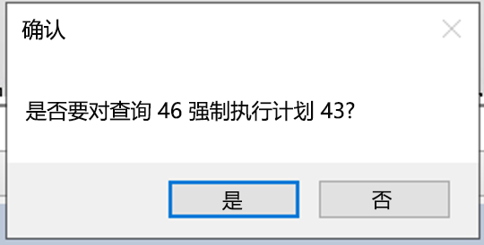

---
lab:
    title: '实验室 5 – 查询性能疑难解答'
    module: '优化查询性能'
---


# 实验室 5 – 查询性能疑难解答

**预估时间**：75 分钟

**实验室文件**：本实验室的文件位于 D:\Labfiles\Query 性能文件夹中。


# 实验室概述

学生将评估数据库设计中的规范化、数据类型选择和索引设计问题。他们将运行次优性能的查询，检查查询计划，并尝试在 AdventureWorks2017 数据库中进行改进。

# 实验室目标

完成本实验室后，你将能够：

1. 确定数据库设计问题

	- 根据数据库设计评估查询

	- 检查现有设计是否有潜在的不良模式，例如规范化过度/不足或数据类型错误 

2. 隔离性能较差的查询中的问题区域 

	- 运行查询以生成不使用 GUI 的实际执行计划

	- 评估给定的执行计划（例如键查找） 

3. 使用查询存储来检测和处理回归 

	- 运行工作负载生成查询存储的查询统计信息 

	- 检查最消耗资源的查询以确定较差性能 

	- 强制执行更好的执行计划 

4. 使用查询提示影响性能 

	- 运行工作负载 

	- 更改查询以使用“参数”值

	- 将查询提示应用于查询以优化某个值 

# 应用室场景

你已被聘为高级数据库管理员，以帮助解决用户查询 AdventureWorks2017 数据库时产生的性能问题。你的工作是确定查询性能中的问题，并使用从本模块中学到的技能来解决这些问题。

第一步是查看用户遇到问题的查询并提出建议：

1. 确定 AdventureWorks2017 中的数据库设计问题

2. 隔离 AdventureWorks2017 中性能较差的查询中的问题区域

3. 使用查询存储来检测和处理 AdventureWorks2017 中的回归问题

4. 使用查询提示影响 AdventureWorks2017 中的性能
 
        

**备注：** 练习让你复制并粘贴 T-SQL 代码。请在执行代码前，验证代码是否正确复制并具有恰当的换行符。 

       


# 练习 1：确定 AdventureWorks2017 中的数据库设计问题

预计用时：15 分钟

本练习的主要任务如下：

1. 检查查询并确定看到警告的原因以及警告内容。

2. 提出两种解决问题的方法。

	- 更改查询以解决此问题。

	- 建议更改数据库设计以解决此问题。

## 任务 1：检查查询并确定问题。

1. 从实验室虚拟机中，启动 **SQL Server Management Studio (SSMS)**。 

	

2. 系统将提示你连接到 SQL Server。  
输入服务器名称 LON-SQL1，并确保选中“ Windows 身份验证”，然后单击“连接”。

	

‎	
3. 打开“新建查询”窗口。将以下代码复制并粘贴到查询窗口中。

```sql
USE AdventureWorks2017;

SELECT BusinessEntityID, NationalIDNumber, LoginID, HireDate, JobTitle 

FROM HumanResources.Employee 

WHERE NationalIDNumber = 14417807;
```

4. 在运行查询之前，单击下文所示的“包括实际执行计划”图标，或键入 CTRL + M。这样在执行查询时，就会显示执行计划。
	  
‎

5. 单击“执行”按钮以执行此查询。 

6. 通过在 SSMS 的结果面板中单击“执行计划”选项卡，导航到执行计划。在执行计划中，将鼠标移动到 SELECT 运算符上方。你将注意到由黄色三角形中的感叹号标识的警告消息，如下所示。确定警告消息告诉你的内容。 
	

	隐式转换会导致性能问题。


## 任务 2：确定解决警告问题的两种方法

该表结构在以下数据定义语言 (DDL) 语句中显示。

```sql
CREATE TABLE [HumanResources].[Employee](

 [BusinessEntityID] [int] NOT NULL,

 [NationalIDNumber] [nvarchar](15) NOT NULL,

 [LoginID] [nvarchar](256) NOT NULL,

 [OrganizationNode] [hierarchyid] NULL,

 [OrganizationLevel] AS ([OrganizationNode].[GetLevel]()),

 [JobTitle] [nvarchar](50) NOT NULL,

 [BirthDate] [date] NOT NULL,

 [MaritalStatus] [nchar](1) NOT NULL,

 [Gender] [nchar](1) NOT NULL,

 [HireDate] [date] NOT NULL,

 [SalariedFlag] [dbo].[Flag] NOT NULL,

 [VacationHours] [smallint] NOT NULL,

 [SickLeaveHours] [smallint] NOT NULL,

 [CurrentFlag] [dbo].[Flag] NOT NULL,

 [rowguid] [uniqueidentifier] ROWGUIDCOL NOT NULL,

 [ModifiedDate] [datetime] NOT NULL

) ON [PRIMARY]
```


1. 使用代码作为解决方案来修复查询。

确定哪个列导致了隐式转换及其原因。 

如果查看任务 1 中的查询，你将注意到与 WHERE 子句中的 NationalIDNumber 列比较的值以数字形式输入，因为它不是带引号的字符串。检查表结构后，你将发现该表中的此列使用 nvarchar(15) 数据类型，而不是 int 或 integer 数据类型。这种数据类型的不一致导致优化器在执行时将常量隐式转换为 nvarchar，从而导致使用次优计划的查询性能产生额外的开销。

2. 更改代码以解决隐式转换，然后重新运行查询。如果上面的练习尚未开启“包括实际执行计划” (Cnt l+ M)，请记住将其开启。请注意，警告现在已经消失。

更改 WHERE 子句，以使与 NationalIDNumber 列比较的值和表中该列的数据类型一致，这样就可以消除隐式转换。在这种情况下，只需在值的两边加上单引号，就可以将其从数字更改为字符串。使此查询的查询窗口保持打开状态。

```sql
SELECT BusinessEntityID, NationalIDNumber, LoginID, HireDate, JobTitle 

FROM HumanResources.Employee 

WHERE NationalIDNumber = '14417807'
```


3. 使用数据库设计更改来修复查询。 

要尝试修复索引，可以打开新的查询窗口，复制以下查询以更改此列的数据类型。通过单击“执行”，尝试执行查询。

```sql
ALTER TABLE [HumanResources].[Employee] ALTER COLUMN [NationalIDNumber] INT NOT NULL;
```

对该表做出的更改可解决转换问题。但是，这种更改产生了另一个你作为数据库管理员需要解决的问题。由于此列是已存在的非聚集索引的一部分，因此必须重新构建/重新创建索引才能执行数据类型更改。这可能会导致在生产环境中长时间停机，这突显了在设计中选择正确数据类型的重要性。 

Msg 5074, Level 16, State 1, Line 1 索引“AK_Employee_NationalIDNumber”依赖于列“NationalIDNumber”。

Msg 4922, Level 16, State 9, Line 1

ALTER TABLE ALTER COLUMN NationalIDNumber 失败，因为有一个或多个对象访问此列。

 

4. 为了解决此问题，请将下面的代码复制并粘贴到查询窗口中，然后单击“执行”予以执行。

```sql
USE AdventureWorks2017
GO

DROP INDEX [AK_Employee_NationalIDNumber] ON [HumanResources].[Employee]
GO

ALTER TABLE [HumanResources].[Employee] ALTER COLUMN [NationalIDNumber] INT NOT NULL;
GO

CREATE UNIQUE NONCLUSTERED INDEX [AK_Employee_NationalIDNumber] ON [HumanResources].[Employee]

( [NationalIDNumber] ASC

);
GO
```

5. 重新运行不带引号的原始查询。

```sql
USE AdventureWorks2017;

SELECT BusinessEntityID, NationalIDNumber, LoginID, HireDate, JobTitle 

FROM HumanResources.Employee 

WHERE NationalIDNumber = 14417807;
```

注意，执行计划不再有警告消息。 

# 练习 2：隔离 AdventureWorks2017 中性能较差的查询中的问题区域

预计用时：30 分钟

本练习的任务如下：

1. 运行查询以生成实际执行计划。 

2. 评估给定的执行计划（例如键查找）。 

## 任务 1：运行查询以生成实际执行计划

有几种方法可以在 SQL Server Management Studio 中生成执行计划。你将使用练习 1 中的同一种查询。将下面的代码复制并粘贴到新的查询窗口中，然后单击“执行”来执行该代码。

使用 SHOWPLAN_ALL 设置，我们可以获得与上一练习相同的信息，但该信息出现在结果窗格而非图形结果中。

```sql
USE AdventureWorks2017; 

GO 

SET SHOWPLAN_ALL ON; 

GO 

SELECT BusinessEntityID 

FROM HumanResources.Employee 

WHERE NationalIDNumber = '14417807'; 

GO 

SET SHOWPLAN_ALL OFF; 

GO 
```

这显示了执行计划的文本版本。

  
‎

## 任务 2：解决执行计划中的性能问题

1. 将下面代码复制粘贴到新的查询窗口中。在运行查询之前，单击“包括实际执行计划”图标，或按“Ctrl+M”。通过单击“执行”来执行查询。记下消息选项卡中的执行计划和逻辑读取。

```sql
SET STATISTICS IO, TIME ON;

SELECT SalesOrderID, CarrierTrackingNumber, OrderQty, ProductID, UnitPrice, ModifiedDate

FROM AdventureWorks2017.Sales.SalesOrderDetail WHERE ModifiedDate > '2012/05/01' AND ProductID = 772;
```

在查看执行计划时，你将注意到存在键查找。如果将鼠标移动到该图标上方，将看到属性指示对查询检索到的每一行执行该操作。可以看到执行计划正在执行键查找操作。 

要确定需要更改哪个索引来删除键查找，需要检查其上方的索引搜寻。将鼠标悬停在索引查找运算符上，此时将显示该运算符的属性。记下输出列表，如下所示。 


2. 修复键查找，并重新运行查询以查看新计划。通过添加包含所有查询返回或搜索列的 COVERING 索引来修复键查找。在本示例中，该索引只有 **ProductID**。如果我们将输出列表添加到该索引作为包含的列，并添加其他搜索列（**“ModifiedDate”**）作为键列，则会移除键查找。由于已存在该索引，因此必须删除索引并重新创建索引，或者设置 DROP_EXISTING = ON 方可添加列。注意，**ProductID** 已经是索引的一部分，无需作为包含的列进行添加。

```sql
CREATE NONCLUSTERED INDEX IX_SalesOrderDetail_ProductID

ON [Sales].[SalesOrderDetail] (ProductID, ModifiedDate)

INCLUDE (CarrierTrackingNumber,OrderQty, UnitPrice)

WITH (DROP_EXISTING = ON);

GO
```

3. 从步骤 1 重新运行查询。记录逻辑读取和执行计划的更改

# 练习 3：使用查询存储来检测和处理 AdventureWorks2017 中的回归问题。

预计用时：15 分钟

本练习的任务如下所示：

1. 运行工作负载生成 QS 的查询统计信息 

2. 检查最消耗资源的查询以确定较差性能 

3. 强制执行更好的执行计划。 

## 任务 1：运行工作负载生成查询存储的查询统计信息

1. 将下面的代码复制并粘贴到新的查询窗口中，然后单击“执行”来执行该代码。记下消息选项卡中的执行计划和逻辑读取。该脚本将启用 AdventureWorks2017 的查询存储，并将数据库设置为兼容性级别 100

```sql
USE master;
GO

ALTER DATABASE AdventureWorks2017 SET QUERY_STORE = ON;
GO

ALTER DATABASE AdventureWorks2017 SET QUERY_STORE (OPERATION_MODE = READ_WRITE);
GO

ALTER DATABASE AdventureWorks2017 SET COMPATIBILITY_LEVEL = 100;
GO
```


2. 在 SQL Server Management Studio 的菜单中，选择“文件”>“打开”>“文件”。导航到“D:\Labfiles\Query Performance\CreateRandomWorkloadGenerator.sql” 文件。单击文件将其加载到 Management Studio 中，然后单击“执行”执行查询。


 
3. 运行工作负载以生成查询存储的统计信息。导航到“D:\Labfiles\Query Performance\ExecuteRandomWorkload.sql”脚本以执行工作负载。单击“执行”，运行此脚本。执行完成后，再次运行脚本以生成更多数据。使此查询的查询选项卡保持打开状态。

4. 将下面的代码复制并粘贴到新的查询窗口中，然后单击“执行”来执行该代码。此脚本使用以下脚本将数据库兼容性模式更改为 SQL Server 2019 (150)。

```sql
USE master;
GO

ALTER DATABASE AdventureWorks2017 SET COMPATIBILITY_LEVEL = 150;
GO
```

5. 从步骤 3 (ExecuteRandomWorkload.sql) 导航回到查询选项卡，然后重新执行。

## 任务 2：检查最消耗资源的查询以确定较差性能

1. 为了查看查询存储，需要在 Management Studio 中刷新 AdventureWorks2017 数据库。确保 Management Studio 连接到本地 SQL Server 实例。右键单击数据库名称，然后选择单击刷新。然后你将在数据库下看到“查询存储”选项。  
‎
	  
‎

2. 展开查询存储节点以查看所有可用报表。单击“正号”以展开查询存储报告。通过双击选择“排名靠前的资源消耗查询报表”。

	

	该报告将如下所示打开。  
	‎
	
	
	确保 SQL Server Management Studio 的大小已最大化。单击右上方的“配置”。 

	

	在配置屏幕中，将最小查询计划数筛选器更改为 2。单击“应用”并关闭配置窗口。

	

 

3. 单击报表左上方条形图中最左侧的条，选择持续时间最长的查询。

	  
‎


	这将显示查询存储中最长持续时间的查询及其计划摘要。 

	

## 任务 3：强制执行更好的执行计划

1. 导航到报告的计划摘要部分，如下所示。你将注意到有两个持续时间相差很大的执行计划。

	  
‎

2. 单击报告右上方窗口中持续时间最短的计划 ID（由图表 Y 轴下部位置指示）。上图中是计划 ID 43，但计划 ID 有可能不同。单击“计划摘要”图表旁边的计划 ID（应突出显示，如上面的屏幕截图所示）。

3. 单击摘要图表下的 **“强制计划”**。随后将弹出一个确认窗口，请选择“是”强制执行计划。

	   
‎

	一旦强制执行，你将看到“强制计划”现在已变灰，而计划摘要窗口中的计划现在带有一个复选标记，表示已被强制执行。

	
	
	
4. 关闭所有查询窗口和查询存储报表。
	

# 练习 4：使用查询提示影响 AdventureWorks2017 中的性能

预计用时：15 分钟

本练习的主要任务如下：

1. 运行工作负载。 

2. 更改查询以使用参数

3. 将查询提示应用于查询以优化某个值，然后重新执行。

## 任务 1：运行工作负载

1. 在 SQL Server Management Studio 中打开新的查询窗口。在运行查询之前，单击“包含实际执行计划”图标，或按 CTRL+M 键。
	
      
‎
2. 执行以下查询。请注意，执行计划显示 index seek 运算符。
        
	```sql
	USE AdventureWorks2017

	GO

	SELECT SalesOrderId, OrderDate

	FROM Sales.SalesOrderHeader 

	WHERE SalesPersonID=288;
	```
 
	

3. 现在运行下一个查询。唯一的变化是要搜索的 SalesPersonID 值是 277。请注意执行计划中的“聚集索引扫描”操作。

	```sql
	USE [AdventureWorks2017]

	GO

	SELECT SalesOrderId, OrderDate

	FROM Sales.SalesOrderHeader

	WHERE SalesPersonID=277;
	```

	

    由于 WHERE 子句使用的值不同，查询优化器基于列统计信息选择了不同的执行计划。由于此查询在其 WHERE 子句中使用常量，因此优化程序将把这些查询视为唯一查询，并为每个查询生成不同的执行计划。

## 任务 2：更改查询以使用参数化存储过程并使用查询提示

1. 打开“新建查询”窗口。单击“包含实际执行计划”，或使用 CTRL+M。

2. 创建参数化存储过程，使要搜索的值可以作为参数（而不是 WHERE 子句中的硬编码值）传递。应该确保参数的数据类型与目标表中列的数据类型匹配。复制并执行以下代码。 

    ```sql
    USE AdventureWorks2017  
    GO 
    
    CREATE OR ALTER PROCEDURE getSalesOrder  
    @PersonID INT 
    AS 
    SELECT SalesOrderId, OrderDate 
    FROM Sales.SalesOrderHeader 
    WHERE SalesPersonID = @PersonID 
    GO
    
    ```

3. 使用参数值 277 调用过程。复制并执行以下代码： 

    ```sql
    EXEC getSalesOrder 277 
    GO  
    ```

    正如我们之前看到的，运行非参数化 SELECT 语句查找值 277 时，计划显示聚集索引扫描的使用。 
    
4. 使用参数值 288 再次运行过程。复制并执行以下代码： 

    ```sql
    EXEC getSalesOrder 288 
    GO  
    ``` 

    如果检查执行计划，你会注意到它与 277 的值相同。这是因为 SQL Server 已缓存了执行计划，并且正重用于过程的第二次执行。请注意，尽管两个查询使用相同的计划，但不一定是最佳计划。

5. 执行以下命令以清除 AdventureWorks2017 数据库的计划缓存

    ```sql
    USE AdventureWorks2017  
    GO 
    ALTER DATABASE SCOPED CONFIGURATION CLEAR PROCEDURE_CACHE;  
    GO
    ```

6. 使用参数值 288 再次运行过程。复制并执行以下代码： 

    ```sql
    EXEC getSalesOrder 288 
    GO  
    ``` 

    你应该注意到计划现在使用非聚集索引查找操作。  这是因为缓存计划已删除，并基于新的初始参数值 288 创建了新计划。 
 
7. 现在使用查询提示重新创建存储过程。由于 OPTION 提示，优化器将基于值 288 创建计划，无论什么参数值传递到过程，都将使用该计划。 

    多次执行过程，注意它始终通过非聚集索引查找使用该计划。尝试使用我们还没有见过的参数值调用过程，你将发现无论返回多少行（或不返回行！），计划将始终使用非聚集索引查找。 

    ```sql
    USE AdventureWorks2017  
    GO 
    
    CREATE OR ALTER PROCEDURE getSalesOrder  
    @PersonID INT 
    AS 
    SELECT SalesOrderId, OrderDate  
    FROM Sales.SalesOrderHeader   
    WHERE SalesPersonID = @PersonID  
    OPTION (OPTIMIZE FOR (@PersonID = 288));  
    GO    
    
    EXEC getSalesOrder 288; 
    GO  
    
    EXEC getSalesOrder 277; 
    GO 
    
    EXEC getSalesOrder 200;
    GO 
    ``` 

8. 关闭所有查询窗口。 
