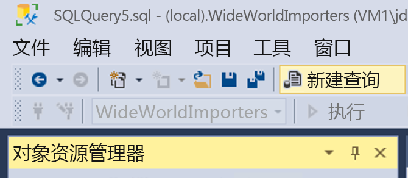
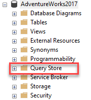
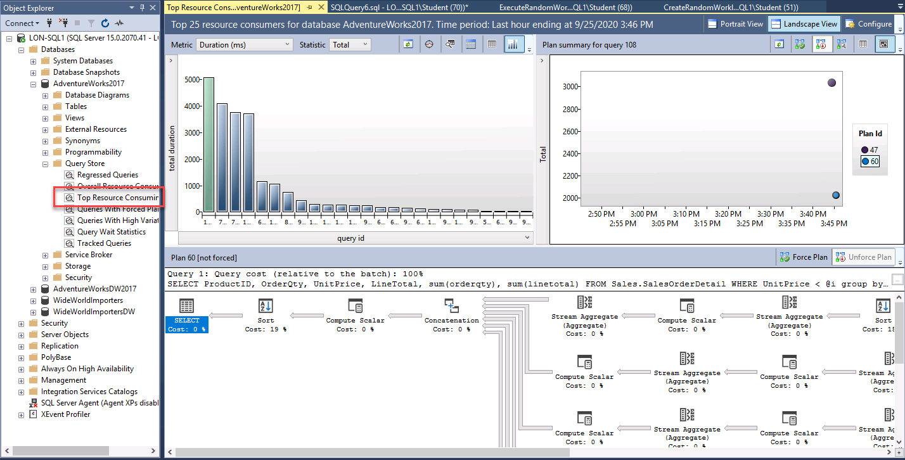
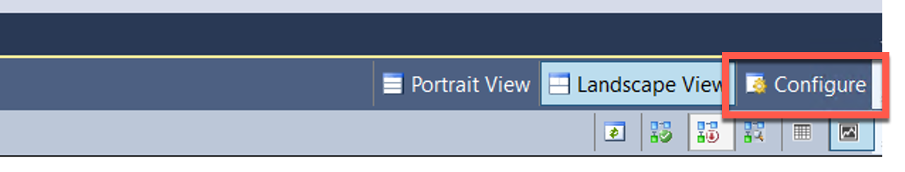

---
lab:
  title: 实验室 5 – 查询性能疑难解答
  module: Optimize Query Performance
---


# <a name="lab-5--query-performance-troubleshooting"></a>实验室 5 – 查询性能疑难解答

预计用时：75 分钟

实验室文件：本实验室的文件位于 D:\Labfiles\Query 性能文件夹中。


# <a name="lab-overview"></a>实验室概述

The students will evaluate a database design for problems with normalization, data type selection and index design. They will run queries with suboptimal performance, examine the query plans, and attempt to make improvements within the AdventureWorks2017 database.

# <a name="lab-objectives"></a>实验室目标

完成本实验室后，你将能够：

1. 找出数据库设计的问题

    - 根据数据库设计评估查询

    - 检查现有设计是否有潜在的不良模式，例如规范化过度/不足或数据类型错误 

2. 隔离性能较差的查询中的问题区域 

    - 运行查询以生成不使用 GUI 的实际执行计划

    - 评估给定的执行计划（例如键查找） 

3. 使用查询存储来检测和处理回归 

    - 运行工作负载生成查询存储的查询统计信息 

    - 检查资源消耗量最大的几个查询以确定性能不佳问题 

    - 强制执行更好的执行计划 

4. 使用查询提示影响性能 

    - 运行工作负载 

    - 更改查询以使用“参数”值

    - 将查询提示应用于查询以优化某个值 

# <a name="scenario"></a>方案

You have been hired as a Senior Database Administrator to help with performance issues currently happening when users query the AdventureWorks2017 database. Your job is to identify issues in query performance and remedy them using techniques learned in this module.

第一步是查看用户遇到问题的查询并提出建议：

1. 确定 AdventureWorks2017 中的数据库设计问题

2. 隔离 AdventureWorks2017 中性能较差的查询中的问题区域

3. 使用查询存储来检测和处理 AdventureWorks2017 中的回归问题

4. 使用查询提示影响 AdventureWorks2017 中的性能
 
        

<bpt id="p1">**</bpt>Note:<ept id="p1">**</ept> The exercises ask you to copy and paste T-SQL code. Please verify that the code has been copied correctly, with the proper line breaks, before executing the code. 

       


# <a name="exercise-1-identify-issues-with-database-design-in-adventureworks2017"></a>练习 1：确定 AdventureWorks2017 中的数据库设计问题

预计时间：15 分钟

本次练习的主要任务如下：

1. 检查查询并确定看到警告的原因以及警告内容。

2. 提出两种解决问题的方法。

    - 更改查询以解决此问题。

    - 建议更改数据库设计以解决此问题。

## <a name="task-1-examine-the-query-and-identify-the-problem"></a>任务 1：检查查询并确定问题。

1. 从实验室虚拟机中，启动 SQL Server Management Studio (SSMS)。 

    

2. 系统将提示你连接到 SQL Server。  
输入服务器名称 LON-SQL1，并确保选中“ Windows 身份验证”，然后单击“连接”。

    

‎   
3. Open a new query window. Copy and paste the code below into your query window.

```sql
USE AdventureWorks2017;

SELECT BusinessEntityID, NationalIDNumber, LoginID, HireDate, JobTitle 

FROM HumanResources.Employee 

WHERE NationalIDNumber = 14417807;
```

4. Click on Include Actual Execution Plan icon as shown below before running the query or type CTRL+M. This will cause the execution plan to be displayed when you execute the query.
    <ph id="ph1"></ph>  
‎

5. 单击“执行”按钮以执行此查询。 

6. Navigate to the execution plan, by clicking on Execution plan tab in the results panel in SSMS. In the execution plan, move your mouse over the SELECT operator. You will note a warning message identified by an exclamation point in a yellow triangle as shown below. Identify what the Warning Message tells you. 
    <ph id="ph1"></ph>

    隐式转换会导致性能问题。


## <a name="task-2-identify-two-ways-to-fix-the-warning-issue"></a>任务 2：确定解决警告问题的两种方法

表的结构如以下数据定义语言 (DDL) 语句所示。

```sql
CREATE TABLE [HumanResources].[Employee](

 [BusinessEntityID] [int] NOT NULL,

 [NationalIDNumber] [nvarchar](15) NOT NULL,

 [LoginID] [nvarchar](256) NOT NULL,

 [OrganizationNode] [hierarchyid] NULL,

 [OrganizationLevel] AS ([OrganizationNode].[GetLevel]()),

 [JobTitle] [nvarchar](50) NOT NULL,

 [BirthDate] [date] NOT NULL,

 [MaritalStatus] [nchar](1) NOT NULL,

 [Gender] [nchar](1) NOT NULL,

 [HireDate] [date] NOT NULL,

 [SalariedFlag] [dbo].[Flag] NOT NULL,

 [VacationHours] [smallint] NOT NULL,

 [SickLeaveHours] [smallint] NOT NULL,

 [CurrentFlag] [dbo].[Flag] NOT NULL,

 [rowguid] [uniqueidentifier] ROWGUIDCOL NOT NULL,

 [ModifiedDate] [datetime] NOT NULL

) ON [PRIMARY]
```


1. 使用代码作为解决方案来修复查询。

确定哪个列导致了隐式转换及其原因。 

学生将评估数据库设计中的规范化、数据类型选择和索引设计问题。

2. 他们将运行次优性能的查询，检查查询计划，并尝试在 AdventureWorks2017 数据库中进行改进。

By changing the WHERE clause so that the value compared to the NationalIDNumber column matches the column’s data type in the table, you can get rid of the implicit conversion. In this scenario just adding a single quote on each side of the value changes it from a number to a character string. Keep the query window open for this query.

```sql
SELECT BusinessEntityID, NationalIDNumber, LoginID, HireDate, JobTitle 

FROM HumanResources.Employee 

WHERE NationalIDNumber = '14417807'
```


3. 使用数据库设计更改修复查询。 

To attempt to fix the index, open a new query window, and copy the query below to change the column’s data type. Attempt to execute the query by clicking Execute.

```sql
ALTER TABLE [HumanResources].[Employee] ALTER COLUMN [NationalIDNumber] INT NOT NULL;
```

The changes to the table would solve the conversion issue. However this change introduces another issue that as a database administrator you need to resolve. Since this column is part of an already existing nonclustered index, the index has to be rebuilt/recreated in order to execute the data type change. This could lead to extended downtime in production, which highlights the importance of choosing the right data types in your design. 

Msg 5074, Level 16, State 1, Line 1 索引“AK_Employee_NationalIDNumber”依赖于列“NationalIDNumber”。

Msg 4922, Level 16, State 9, Line 1

ALTER TABLE ALTER COLUMN NationalIDNumber 失败，因为有一个或多个对象访问此列。

 

4. 为了解决此问题，请将下面的代码复制并粘贴到查询窗口中，然后单击“执行”予以执行。

```sql
USE AdventureWorks2017
GO

DROP INDEX [AK_Employee_NationalIDNumber] ON [HumanResources].[Employee]
GO

ALTER TABLE [HumanResources].[Employee] ALTER COLUMN [NationalIDNumber] INT NOT NULL;
GO

CREATE UNIQUE NONCLUSTERED INDEX [AK_Employee_NationalIDNumber] ON [HumanResources].[Employee]

( [NationalIDNumber] ASC

);
GO
```

5. 重新运行不带引号的原始查询。

```sql
USE AdventureWorks2017;

SELECT BusinessEntityID, NationalIDNumber, LoginID, HireDate, JobTitle 

FROM HumanResources.Employee 

WHERE NationalIDNumber = 14417807;
```

注意，执行计划不再有警告消息。 

# <a name="exercise-2-isolate-problem-areas-in-poorly-performing-queries-in-adventureworks2017"></a>练习 2：找出 AdventureWorks2017 中性能较差的查询中的问题部分

预计时间：30 分钟

本练习的任务如下：

1. 运行查询以生成实际执行计划。 

2. 评估给定的执行计划（例如键查找）。 

## <a name="task-1-run-a-query-to-generate-the-actual-execution-plan"></a>任务 1：运行查询以生成实际执行计划

There are several ways to generate an execution plan in SQL Server Management Studio. You will use the same query from Exercise 1. Copy and paste the code below into a new query window and execute it by clicking Execute.

使用 SHOWPLAN_ALL 设置，我们可以获得与上一练习相同的信息，但该信息出现在结果窗格而非图形结果中。

```sql
USE AdventureWorks2017; 

GO 

SET SHOWPLAN_ALL ON; 

GO 

SELECT BusinessEntityID 

FROM HumanResources.Employee 

WHERE NationalIDNumber = '14417807'; 

GO 

SET SHOWPLAN_ALL OFF; 

GO 
```

这显示了执行计划的文本版本。

  
‎

## <a name="task-2-resolve-a-performance-problem-from-an-execution-plan"></a>任务 2：解决执行计划的性能问题

1. Copy and paste the code below into a new query window. Click on Include Actual Execution Plan icon before running the query, or type CTRL+M. Execute the query by clicking Execute. Make note of the execution plan and the logical reads in the messages tab.

```sql
SET STATISTICS IO, TIME ON;

SELECT SalesOrderID, CarrierTrackingNumber, OrderQty, ProductID, UnitPrice, ModifiedDate

FROM AdventureWorks2017.Sales.SalesOrderDetail WHERE ModifiedDate > '2012/05/01' AND ProductID = 772;
```

When reviewing the execution plan you will note there is a key lookup. If you move your mouse over the icon, you will see that the properties indicate it is performed for each row retrieved by the query. You can see the execution plan is performing a Key Lookup operation. 

To identify what index needs to be altered in order to remove the key lookup, you need to examine the index seek above it. Hover over the index seek operator with your mouse and the properties of the operator will appear. Make note of the output list as shown below. 


2. Fix the Key Lookup and rerun the query to see the new plan. Key Lookups are fixed by adding a COVERING index that INCLUDES all columns being returned or searched in the query. In this example the index only had <bpt id="p1">**</bpt>ProductID<ept id="p1">**</ept>. If we add the output list columns to the index as included columns, and add the other search column (<bpt id="p1">**</bpt>ModifiedDate<ept id="p1">**</ept>) as a key column, then the Key Lookup will be removed. Since the index already exists you either have to DROP the index and recreate it or set DROP_EXISTING=ON in order to add the columns. Note <bpt id="p1">**</bpt>ProductID<ept id="p1">**</ept> is already part of the index and does not need to be added as an included column.

```sql
CREATE NONCLUSTERED INDEX IX_SalesOrderDetail_ProductID

ON [Sales].[SalesOrderDetail] (ProductID, ModifiedDate)

INCLUDE (CarrierTrackingNumber,OrderQty, UnitPrice)

WITH (DROP_EXISTING = ON);

GO
```

3. Rerun the query from Step 1. Make note of the changes to the logical reads and execution plan changes

# <a name="exercise-3-use-query-store-to-detect-and-handle-regression-in-adventureworks2017"></a>练习 3：使用查询存储来检测和处理 AdventureWorks2017 中的回归问题。

预计时间：15 分钟

本练习的任务如下所示：

1. 运行工作负载生成 QS 的查询统计信息 

2. 检查资源消耗量最大的几个查询以确定性能不佳问题 

3. 强制执行更好的执行计划。 

## <a name="task-1-run-a-workload-to-generate-query-stats-for-query-store"></a>任务 1：运行工作负载以生成查询存储的查询统计信息

1. Copy and paste the code below into a new query window and execute it by clicking Execute. Make note of the execution plan and the logical reads in the messages tab. This script will enable the Query Store for AdventureWorks2017 and sets the database to Compatibility Level 100

```sql
USE master;
GO

ALTER DATABASE AdventureWorks2017 SET QUERY_STORE = ON;
GO

ALTER DATABASE AdventureWorks2017 SET QUERY_STORE (OPERATION_MODE = READ_WRITE);
GO

ALTER DATABASE AdventureWorks2017 SET COMPATIBILITY_LEVEL = 100;
GO
```


2. From the menu in SQL Server Management Studio, select File &gt; Open &gt; File. Navigate to the D:\Labfiles\Query Performance\CreateRandomWorkloadGenerator.sql file. Click on the file to load it into Management Studio and then click Execute to execute the query.


 
3. Run a workload to generate statistics for Query Store. Navigate to the D:\Labfiles\Query Performance\ExecuteRandomWorkload.sql script to execute a workload. Click execute to run the script. After execution completes, run the script a second time to generate more data. Leave the query tab open for this query.

4. Copy and paste the code below into a new query window and execute it by clicking Execute. This script changes the database compatibility mode using the below script to SQL Server 2019 (150).

```sql
USE master;
GO

ALTER DATABASE AdventureWorks2017 SET COMPATIBILITY_LEVEL = 150;
GO
```

5. 从步骤 3 (ExecuteRandomWorkload.sql) 导航回到查询选项卡，然后重新执行。

## <a name="task-2-examine-top-resource-consuming-queries-to-identify-poor-performance"></a>任务 2：检查资源消耗量最大的几个查询以确定性能不佳问题

1. In order to view the Query Store you will need to refresh the AdventureWorks2017 database in Management Studio. Make sure that Management Studio is connected to the local SQL Server instance. Right click on database name and choose click refresh. You will then see the Query Store option under the database.  
‎   
   ‎

2. Expand Query Store node to view all available reports. Click on plus sign to expand Query Store reports. Select the Top Resource Consuming Queries Report by double-clicking on it.

    

    报表将打开，如下所示。  
    ‎ 
    
    Make sure that SQL Server Management Studio is maximized in size. Click configure in the top right. 

    

    In the configuration screen, change the filter for the minimum number of query plans to 2. Click Apply and close the configuration window.

    

 

3. 单击报表左上方条形图中最左侧的条，选择持续时间最长的查询。

      
‎


    这将显示查询存储中最长持续时间的查询及其计划摘要。 

    

## <a name="task-3-force-a-better-execution-plan"></a>任务 3：强制执行更好的执行计划

1. Navigate to the plan summary portion of the report as shown below. You will note there are two execution plans with widely different durations.

      
‎

2. 你被聘为高级数据库管理员，以帮助解决当前用户查询 AdventureWorks2017 数据库时遇到的性能问题。

3. 你的工作是使用本模块中所述的技术来确定查询性能方面的问题并解决问题。

       
‎

    强制执行后，你会看到“强制执行计划”现在为灰显，计划摘要窗口中的计划现在具有一个复选标记，指示已强制执行。

    
    
    
4. 关闭所有查询窗口和查询存储报表。
    

# <a name="exercise-4-use-query-hints-to-impact-performance-in-adventureworks2017"></a>练习 4：使用查询提示影响 AdventureWorks2017 中的性能

预计时间：15 分钟

本次练习的主要任务如下：

1. 运行工作负载。 

2. 更改查询以使用参数

3. 将查询提示应用于查询以优化某个值，然后重新执行。

## <a name="task-1-run-a-workload"></a>任务 1：运行工作负载

1. Open a New Query window in SQL Server Management Studio. Click on Include Actual Execution Plan icon before running the query or use CTRL+M.
    
      
‎
2. Execute the query below. Note that the execution plan shows an index seek operator.
        
    ```sql
    USE AdventureWorks2017

    GO

    SELECT SalesOrderId, OrderDate

    FROM Sales.SalesOrderHeader 

    WHERE SalesPersonID=288;
    ```
 
    

3. Now run the next query. The only change is that the SalesPersonID value being searched for is 277. Note the Clustered Index Scan operation in the execution plan.

    ```sql
    USE [AdventureWorks2017]

    GO

    SELECT SalesOrderId, OrderDate

    FROM Sales.SalesOrderHeader

    WHERE SalesPersonID=277;
    ```

    

    Based on the column statistics the query optimizer has chosen a different execution plan because of the different value used in the WHERE clause. Because this query uses a constant in its WHERE clause, the optimizer sees each of these queries as unique and generates a different execution plan for each one.

## <a name="task-2-change-the-query-to-use-a-parameterized-stored-procedure-and-use-a-query-hint"></a>任务 2：更改查询以使用参数化存储过程并使用查询提示

1. Open a New Query window. Click on Include Actual Execution Plan or use CTRL+M.

2. Create a parameterized stored procedure so that the value to be searched for can be passed as a parameter instead of a hard-coded value in the WHERE clause. You should ensure that the data type of your parameter matches the data type of the column in the target table. Copy and execute the code below. 

    ```sql
    USE AdventureWorks2017  
    GO 
    
    CREATE OR ALTER PROCEDURE getSalesOrder  
    @PersonID INT 
    AS 
    SELECT SalesOrderId, OrderDate 
    FROM Sales.SalesOrderHeader 
    WHERE SalesPersonID = @PersonID 
    GO
    
    ```

3. **注意：** 练习让你复制并粘贴 T-SQL 代码。 

    ```sql
    EXEC getSalesOrder 277 
    GO  
    ```

    正如我们之前看到的，运行非参数化 SELECT 语句查找值 277 时，计划显示聚集索引扫描的使用。 
    
4. 请在执行代码前，验证代码是否正确复制并具有恰当的换行符。 

    ```sql
    EXEC getSalesOrder 288 
    GO  
    ``` 

    If you examine the execution plan, you will note it is the same as it was for the value of 277. This is because SQL Server has cached the execution plan and is reusing it for the second execution of the procedure. Note that although the same plan is used for both queries, it is not necessarily the best plan.

5. 执行以下命令以清除 AdventureWorks2017 数据库的计划缓存

    ```sql
    USE AdventureWorks2017  
    GO 
    ALTER DATABASE SCOPED CONFIGURATION CLEAR PROCEDURE_CACHE;  
    GO
    ```

6. Run the procedure again with a parameter value of 288. Copy and execute the following code: 

    ```sql
    EXEC getSalesOrder 288 
    GO  
    ``` 

    You should notice the plan is now using the Nonclustered Index Seek operation.  This is because the cached plan was removed and a new plan was created based on the new initial parameter value of 288. 
 
7. Now recreate the stored procedure with a Query Hint. Because of the OPTION hint, the optimizer will create a plan based on a value of 288 and that plan will be used no matter what parameter value is passed to the procedure. 

    Execute the procedure multiple times and note that it now always uses the plan with the Nonclustered Index Seek. Try calling with the procedure with parameter values we haven't seen yet, and you'll notice that no matter how many rows are returned (or no rows are returned!) the plan will always use the Nonclustered Index Seek. 

    ```sql
    USE AdventureWorks2017  
    GO 
    
    CREATE OR ALTER PROCEDURE getSalesOrder  
    @PersonID INT 
    AS 
    SELECT SalesOrderId, OrderDate  
    FROM Sales.SalesOrderHeader   
    WHERE SalesPersonID = @PersonID  
    OPTION (OPTIMIZE FOR (@PersonID = 288));  
    GO    
    
    EXEC getSalesOrder 288; 
    GO  
    
    EXEC getSalesOrder 277; 
    GO 
    
    EXEC getSalesOrder 200;
    GO 
    ``` 

8. 关闭所有查询窗口。 
