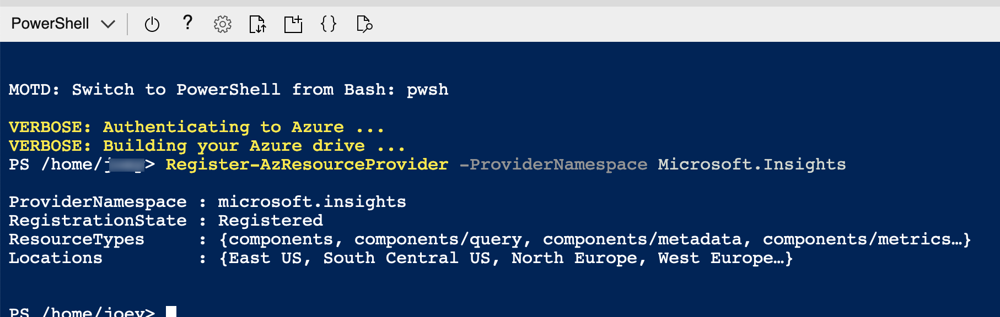
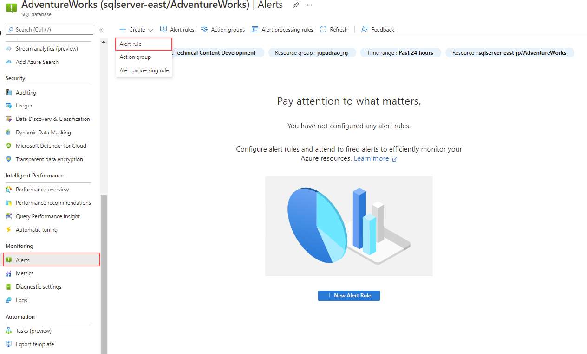
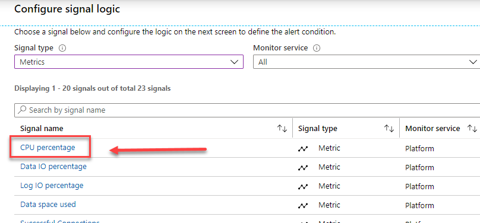
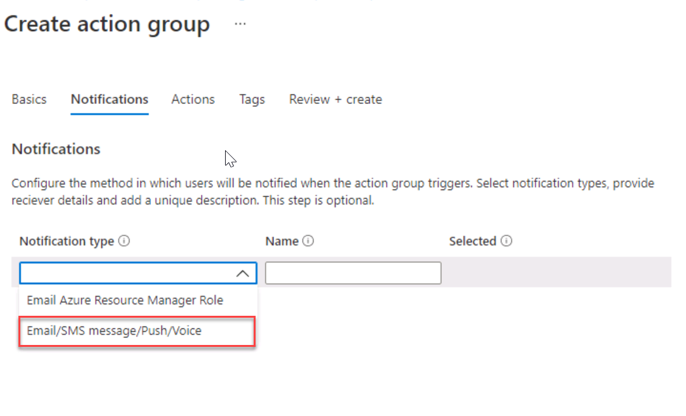
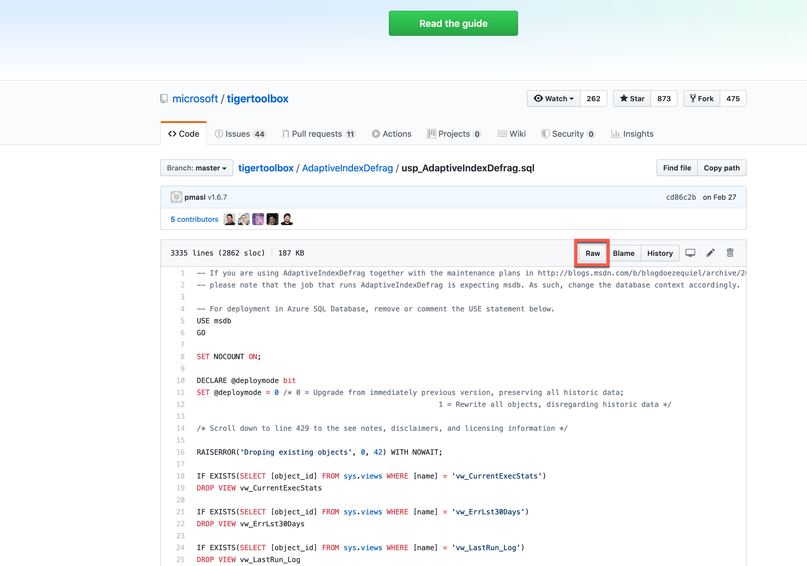
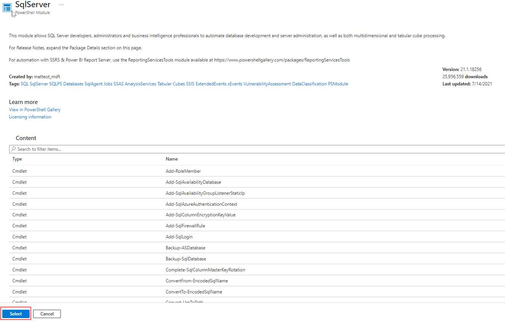
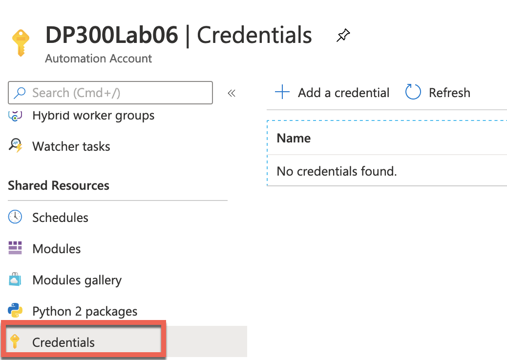
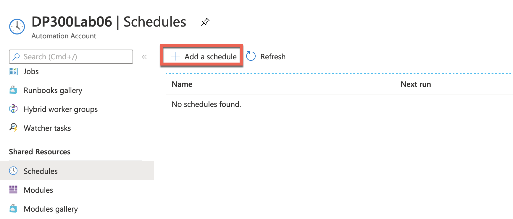
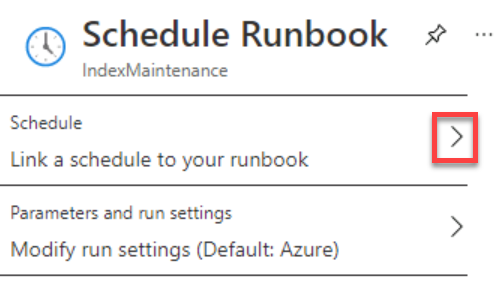

---
lab:
  title: 实验室 6 – 自动化资源
  module: Automation of Tasks
---

# <a name="lab-6--automate-resources"></a>实验室 6 – 自动化资源

预计用时：90 分钟

可以通过访问 Azure 门户从 Web 浏览器执行此实验室。

Note: the Microsoft.Insights module needs to be added to your subscription in order to complete this lab. You can register by completing the following steps.

在 Azure 门户中，单击门户右上角的 Cloud Shell 图标。


A shell will open at the bottom of the screen. Click on PowerShell as shown below.


You may be prompted to create a storage account. Click Create Storage.


PowerShell 窗口打开后，粘贴以下命令，并按 Enter 键。

```sql
register-AzResourceProvider -ProviderNamespace Microsoft.Insights
```



实验室文件：此实验室的文件位于 D:\LabFiles\Automate Resources 文件夹中。

# <a name="lab-overview"></a>实验室概述

学生将利用从课程中获得的信息，在 AdventureWorks 中配置并随后实现自动化流程。

# <a name="lab-objectives"></a>实验室目标

完成本实验室后，你将能够：

- 从 GitHub 快速启动模板部署 Azure 资源

- 配置与性能指标相关的通知

- 部署 Azure 自动化 Runbook 以在 Azure SQL 数据库中执行索引维护

# <a name="scenario"></a>场景

You have been hired as a Senior Data Engineer to help automate day to day operations of database administration. This automation is to help ensure that the databases for AdventureWorks continue to operate at peak performance as well as provide methods for alerting based on certain criteria. AdventureWorks utilizes SQL Server in both Infrastructure as a Service and Platform as a Service offerings.

# <a name="exercise-1-deploy-an-azure-quickstart-template"></a>练习 1：部署 Azure 快速启动模板 

预计时间：30 分钟

个人练习

本练习的主要任务如下：

- 从 GitHub 快速启动模板部署 Azure 资源

## <a name="task-deploy-an-azure-sql-database-from-a-template"></a>任务：通过模板部署 Azure SQL 数据库

1. 使用 Web 浏览器中导航到以下 GitHub。

    [https://github.com/Azure/azure-quickstart-templates/tree/master/quickstarts/microsoft.sql/sql-database-transparent-encryption-create](https://github.com/Azure/azure-quickstart-templates/tree/master/quickstarts/microsoft.sql/sql-database-transparent-encryption-create)

    

    单击 azuredeploy.json，然后查看该文件。

2. Navigate back to the above link (click the back arrow in the top left of the browser), and click on the Deploy to Azure button. You may be prompted to login to the Azure portal. Login with your supplied credentials.

3. 注意：需要将 Microsoft.Insights 模块添加到你的订阅中，才能完成此实验室。

    你可以通过完成以下步骤进行注册。

    - SQL 管理员登录名：labadmin
    - SQL 管理员登录密码：Azur3Pa$$
    - 透明数据加密：**已启用**
    - 位置：[resourceGroup().location]

    

4. Click Review + create, then click Create. Your deployment will begin. You can track the status of your deployment by clicking the bell (highlighted in the screenshot below) and then clicking on the Deployment in progress link in the Notifications pane.

    

    Your deployment will take approximately 5-10 minutes to deploy. If you have clicked on the link above, you will be able to track your deployment.

    

5. 完成后，屏幕将更新，会显示指向新创建的资源的链接。

    

    Click on the Go to resource link. You will be taken to the Azure Resource Group your deployment just created. You should see both a SQL server and a SQL database in the Resource group.  Make note of the name of your SQL server, as you will it in the next exercise.

    

# <a name="exercise-2-configure-performance-metrics-based-alerts"></a>练习 2：配置基于性能指标的警报

预计时间：30 分钟

个人练习

本次练习的主要任务如下：

- 配置与性能指标相关的通知

## <a name="task-creating-an-alert-when-cpu-exceeds-an-average-of-80-percent"></a>任务：当 CPU 超过 80％ 的平均值时创建警报。

1. 屏幕底部将打开一个 Shell。

    

2. 在 sample-db-with-tde 数据库的主边栏选项卡上，向下导航到监视部分。

3. 单击 PowerShell，如下所示。 

    

4. You will notice that the resource is already populated for you with the SQL Server you created. If the <bpt id="p1">**</bpt>Select a signal<ept id="p1">**</ept> window is already open then proceed to the next step. Under the Condition section, click Add condition. 

  

5. 在“配置信号逻辑”浮出控件菜单中，选择“CPU 百分比”。

    

6. Supply a threshold value of 80. Click Done.

    

7. 在“操作”选项卡中的“操作组”部分下，选择“创建操作组” 。

8. 在“创建操作组”屏幕中，键入：
    - 操作组名称：emailgroup
    - 显示名称：emailgroup

    

    选择“下一页:通知 >”。

9. 然后，单击“通知类型”下拉列表，选择“电子邮件/短信/推送/语音”并输入名称 DemoLab 。

    

10. 系统可能会提示你创建存储帐户。

    在“创建警报规则”屏幕上的“详细信息”菜单上，添加名为 DemoAlert 的警报规则，然后选择“查看 + 创建”和“创建”  。

# <a name="exercise-3-deploy-an-automation-runbook"></a>练习 3：部署自动化 Runbook

预计时间：30 分钟

个人练习

此练习的主要任务如下：

- 部署维护任务脚本。

- 部署 Azure 自动化 Runbook 以在 Azure SQL 数据库中执行索引维护

## <a name="task-deploy-an-automation-runbook-to-rebuild-indexes-in-an-azure-sql-database"></a>任务：部署自动化 Runbook 以在 Azure SQL 数据库中重建索引。

1. 单击“创建存储”。 

    

2. 在 Azure 门户的搜索栏中，键入“自动化”，然后单击“自动化帐户”

    

    单击门户中的“+ 创建”按钮。

    

3. 创建自动化帐户

    Resource Group: Use the resource group you created earlier in this lab. <bpt id="p1">**</bpt>DP300-Lab06<ept id="p1">**</ept>

    名称：DP300Lab06

    位置：使用在实验室 2 中创建 Azure SQL 服务器的区域

    Select <bpt id="p1">**</bpt>Review + create<ept id="p1">**</ept> and <bpt id="p2">**</bpt>Create<ept id="p2">**</ept>. Your automation account should deploy in 1-3 minutes.


4. 导航到 AdaptativeIndexDefragmentation 的 GitHub 页。 [https://github.com/microsoft/tigertoolbox/blob/master/AdaptiveIndexDefrag/usp_AdaptiveIndexDefrag.sql](https://github.com/microsoft/tigertoolbox/blob/master/AdaptiveIndexDefrag/usp_AdaptiveIndexDefrag.sql)

    

    Click on Raw. This will provide the code in a format where you can copy it. Select all of the text (Ctrl-A) and copy it to your clipboard (Crtl-C).

5. 在 Azure 门户中，导航回到你的数据库，然后单击“查询编辑器”，如下所示。

    

6. You will be prompted for credentials to login to your database. Use the credentials you created in Exercise 1.
   <bpt id="p1">**</bpt>Login<ept id="p1">**</ept>: labadmin <bpt id="p2">**</bpt>Password<ept id="p2">**</ept>: Azur3Pa$$

    When you try to log in, you may receive an error about a Whitelist IP. Click on the blue <bpt id="p1">**</bpt>Whitelist IP<ept id="p1">**</ept> link at the end of the error message. Doing so will update server firewall rules to allow access.

    

7. After you see a success message, click <bpt id="p1">**</bpt>OK<ept id="p1">**</ept> on the log in screen again. This time you should be granted access to SQL Database Query Editor.

8. In the query editor, paste the text you copied earlier in this task from GitHub into the Query 1 pane. Delete the <bpt id="p1">**</bpt>USE msdb<ept id="p1">**</ept> and <bpt id="p2">**</bpt>GO<ept id="p2">**</ept> statements on lines 5 and 6 of the script.

    

9. Click <bpt id="p1">**</bpt>Run<ept id="p1">**</ept>. The query should result in the following message:

    

10. In the Azure portal, type automation within the search field. Click on <bpt id="p1">**</bpt>Automation Accounts<ept id="p1">**</ept>.

    

    找到已在你的订阅中创建的自动化帐户，然后单击它。

    

12. 在自动化边栏选项卡的共享资源部分，选择“模块”。

    

13. 单击“浏览库”

    

14. 在库中搜索 sqlserver

    

15. Click on the SqlServer text which will direct to the next screen. Click on <bpt id="p1">**</bpt>Select<ept id="p1">**</ept>.
    <ph id="ph1"></ph>

16. On the <bpt id="p1">**</bpt>Add a module<ept id="p1">**</ept> page, select the latest <bpt id="p2">**</bpt>Runtime version<ept id="p2">**</ept> available, and then click <bpt id="p3">**</bpt>Import<ept id="p3">**</ept>. This will import the PowerShell module into your Automation account.

    

17. You will need to create a credential to securely login to your database. From the Automation Account blade navigate to the Shared Resources Section and click <bpt id="p1">**</bpt>Credentials<ept id="p1">**</ept>.

    

18. 单击“+ 添加凭据”，然后创建一个凭据，如下所示：
    - 名称：SQLUser
    - 用户名：labadmin
    - 密码：Azur3Pa$$

    单击“创建”。

    

19. 滚动到“自动化帐户”边栏选项卡的“流程自动化”部分，然后依次单击“Runbook”和“+ 创建 Runbook” 。

    

20. 在“创建 runbook”面板中，输入：
    - 名称：IndexMaintenance
    - Runbook 类型：**PowerShell**
    - 运行时版本：选择可用的最新运行时版本
    - Description: You can supply a short description of your choosing.
    Click <bpt id="p1">**</bpt>Create<ept id="p1">**</ept>.

    

    创建 Runbook 后，进程应会直接进入 Runbook。

21. 你已被聘用为高级数据工程师，以帮助自动执行数据库管理的日常操作。

    

22. 此自动化旨在帮助确保 AdventureWorks 数据库持续以峰值性能运行，并提供基于特定条件发出警报的方法。

    

23. 复制服务器的名称，包括 .database.windows.net 域后缀。

    

24. AdventureWorks 在基础结构即服务和平台即服务产品中都使用 SQL Server。

25. Navigate back to your automation runbook, and paste in the PowerShell code you copied from the PowerShell IDE. Then click Save and then click <bpt id="p1">**</bpt>Publish<ept id="p1">**</ept>.

    

26. 如果系统提示你覆盖任何以前发布的版本，请单击“是”。

    

27. Next you will schedule the runbook to execute on a regular basis. Click on <bpt id="p1">**</bpt>Schedules<ept id="p1">**</ept> in the left hand navigation menu. Then click on <bpt id="p1">**</bpt>+ Add a schedule<ept id="p1">**</ept> at the top.

    

28. 单击“将计划链接到你的 Runbook”。

    

29. 选择“+ 添加计划”。

    

30. 提供描述性计划名称和说明（如果需要）。

31. Specify the start time of 4:00AM of the following day and in the Eastern Time zone. Configure the reoccurrence for every 1 Day. Do not set an expiration.

    

32.  Click <bpt id="p1">**</bpt>Create<ept id="p1">**</ept>. Click <bpt id="p1">**</bpt>OK<ept id="p1">**</ept>.

33. 计划现在已链接到 Runbook。

    
