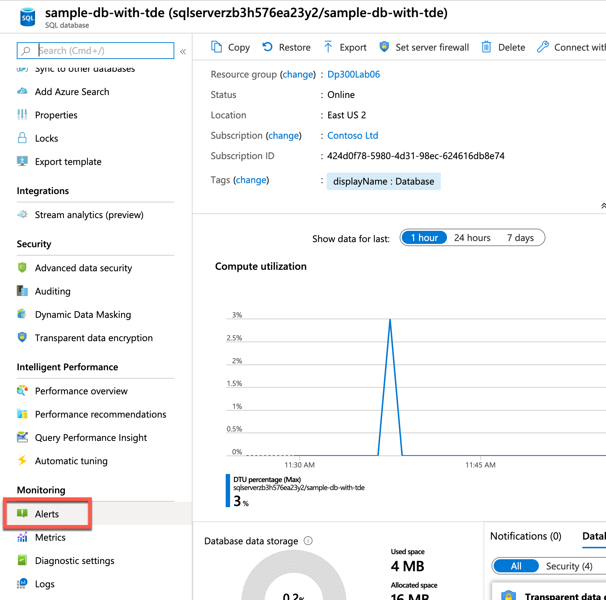
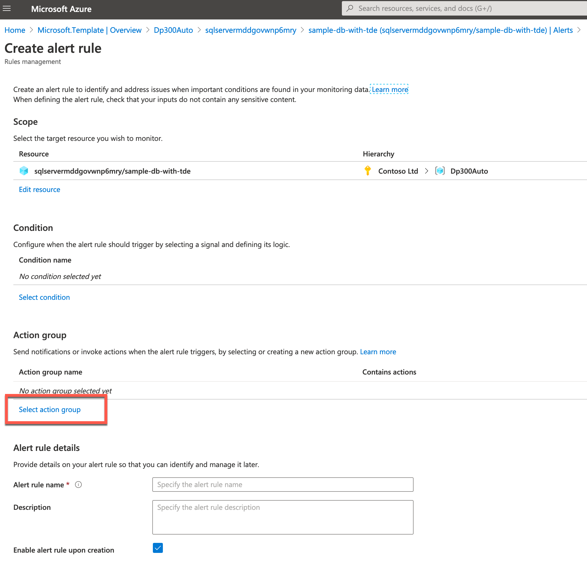
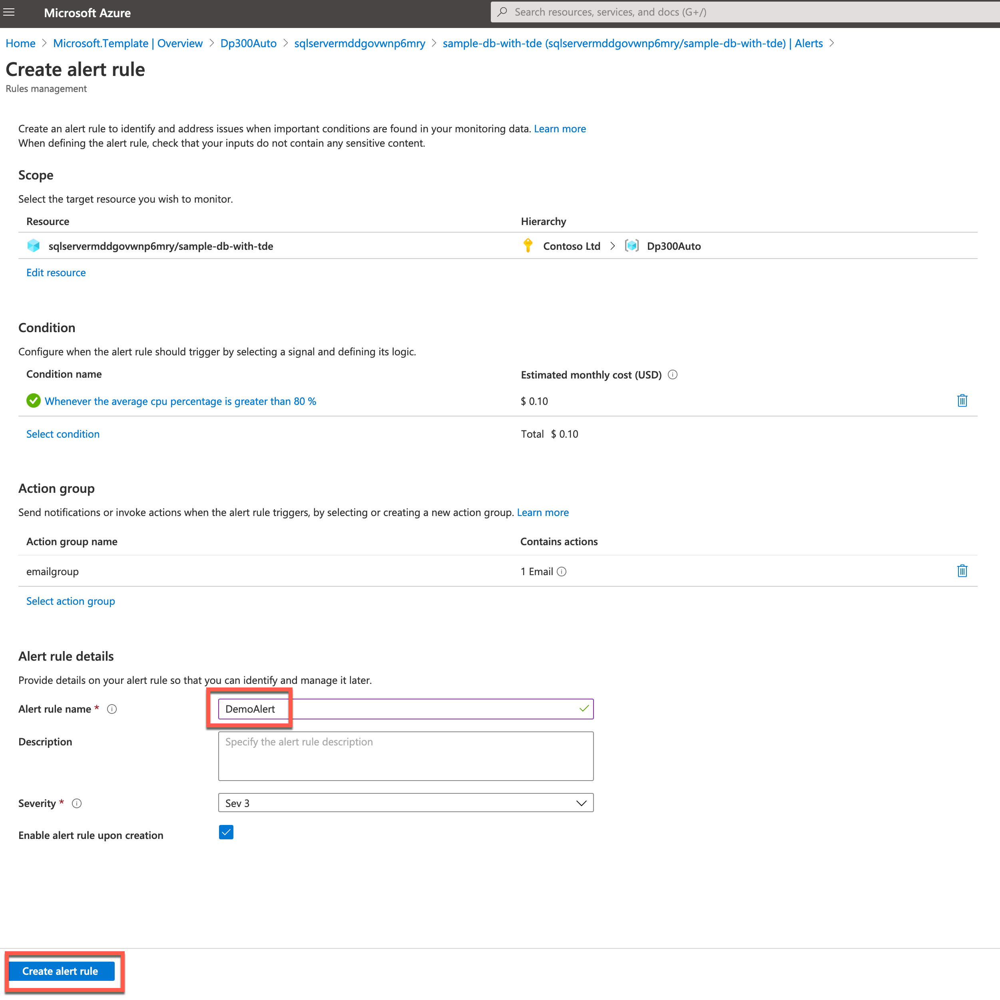
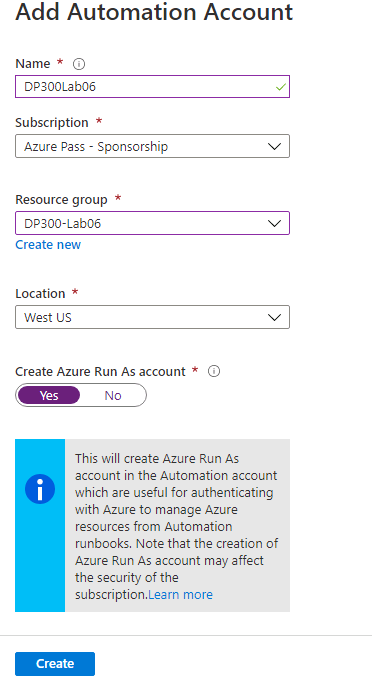
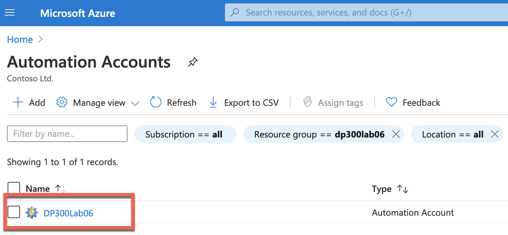
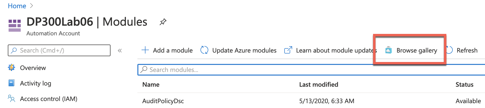
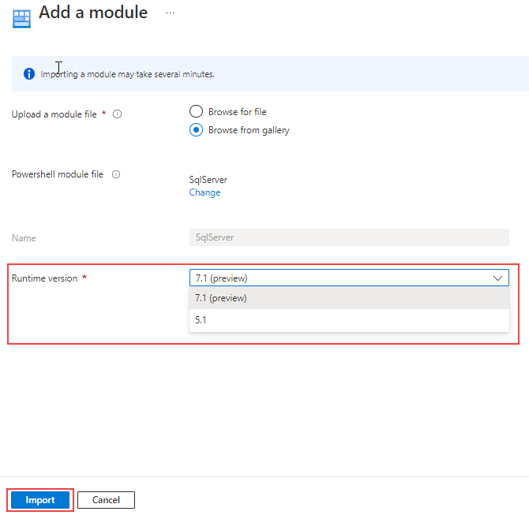

---
lab:
    title: '实验室 6 – 自动化资源'
    module: '任务自动化'
---

# 实验室 6 – 自动化资源

 

**预计用时**： 90 分钟

可以通过访问 Azure 门户从 Web 浏览器执行此实验室。

注意：需要将 Microsoft.Insights 模块添加到你的订阅中，才能完成此实验室。你可以通过完成以下步骤进行注册。 

在 Azure 门户中，单击门户右上角的 Cloud Shell 图标。


屏幕底部将打开一个 Shell。单击 PowerShell，如下所示。


系统可能会提示你创建存储帐户。单击“创建存储”。 


PowerShell 窗口打开后，粘贴以下命令： 

```sql
register-AzResourceProvider -ProviderNamespace Microsoft.Insights
``` 


 

**实验室文件**： 此实验室的文件位于 D:\LabFiles\Automate Resources 文件夹中。

# 实验室概述

学生将利用从课程中获得的信息，在 AdventureWorks 中配置并随后实现自动化流程。 

# 实验室目标

完成本实验室后，你将能够：

- 从 GitHub 快速启动模板部署 Azure 资源

- 配置与性能指标相关的通知

- 部署 Azure 自动化 Runbook 以在 Azure SQL 数据库中执行索引维护

# 应用室场景

你已被聘为高级数据工程师，以帮助自动化数据库管理的日常操作。这种自动化功能有助于确保 AdventureWorks 的数据库继续以最高性能运行，并提供基于某些条件发出警报的方法。AdventureWorks 在基础结构即服务和平台即服务产品中都利用了 SQL Server。 

 

# 练习 1：部署 Azure 快速启动模板 

预计用时：30 分钟

个人练习

本练习的主要任务如下：

- 从 GitHub 快速启动模板部署 Azure 资源

## 任务：通过模板部署 Azure SQL 数据库

1. 使用 Web 浏览器中导航到以下 GitHub。 

    [https://github.com/Azure/azure-quickstart-templates/tree/master/quickstarts/microsoft.sql/sql-database-transparent-encryption-create](https://github.com/Azure/azure-quickstart-templates/tree/master/quickstarts/microsoft.sql/sql-database-transparent-encryption-create)

 
    

    单击 azuredeploy.json，然后查看该文件。 


2. 导航回以上链接（单击浏览器左上角的返回箭头），然后单击“部署到 Azure”按钮。系统可能会提示你登录到 Azure 门户。使用提供的凭据登录。


3. 你将会看到如下所示的屏幕。为了部署此模板，你需要完成空白字段。

    在“资源组”字段中单击“新建”，然后键入 **“DP300-Lab06”**，然后单击“确认”。将区域更改为你附近的区域。在剩余字段中使用以下值：   
    
	- SQL 管理员登录名： **labadmin**
	- SQL 管理员登录密码： **Azur3Pa$$** 
	- 透明数据加密： **启用** 
	- 位置： **[resourceGroup().location]** 

     


4. 单击“查看 + 创建”，然后单击“创建”。你的部署将开始。你可以通过单击铃声（在下面的屏幕截图中突出显示），然后单击“通知”窗格中的“正在进行部署”链接来跟踪部署的状态。

    


    部署大约需要 5-10 分钟。如果已单击上面的链接，则可以跟踪你的部署。 

    

5. 完成后，屏幕将更新，会显示指向新创建的资源的链接。 

    


    单击“转到资源”链接。你将被带到刚刚创建的部署的 Azure 资源组。你应该会在资源组中看到一个 SQL 服务器和一个 SQL 数据库。  记下你的 SQL Server 的名称，因为你将在下一个练习中使用它。

    

 

# 练习 2：配置基于性能指标的警报

预计用时：30 分钟

个人练习

本次练习的主要任务如下：

- 配置与性能指标相关的通知

## 任务：当 CPU 超过 80％ 的平均值时创建警报。

1. 导航到 portal.azure.com（如果你尚未到达此门户）。你可能需要再次登录。在 Azure 门户顶部的搜索栏中，键入“SQL”，然后单击 SQL 数据库。单击数据库名称： **sample-db-with-tde**。

    


2. 在 sample-db-with-tde 数据库的主边栏选项卡上，向下导航至监视部分 

3. 单击“警报”，如下所示。

    


4.  你将看到以下屏幕。单击“+ 新建预警规则”。

    

 

5. 你会注意到，已经用你创建的 SQL Server 填充了资源。在“条件”部分下，单击“添加条件”。

  


6. 在“配置信号逻辑”浮出控件菜单中，选择“CPU 百分比”。 

    


7. 提供阈值 80。点击“完成”。

    

8. 在“操作组”部分下，单击“添加操作组”

    
    

9. 在“操作组”浮出控件中，单击“+ 创建操作组”。


    

    在“创建操作组”屏幕中，键入： 
    - 操作组名称：**emailgroup** 
    - 显示名称：**emailgroup**

    

    选择 **“下一步: 通知 >”**。   
10. 然后，单击“**通知类型**”下拉列表，选择“**电子邮件/短信/推送/语音**”并输入名称 DemoLab。

    


11. 在右侧的浮出控件屏幕（在上图中显示）中，单击电子邮件旁边的复选框，输入电子邮件地址，然后单击“确定”。然后单击“查看 + 创建”按钮，然后在“创建操作组”屏幕上单击“创建”。


    在“创建预警规则”屏幕上，添加名为 DemoAlert 的预警规则，然后单击“创建预警规则”，如下所示。
 

    

 


# 练习 3：部署自动化 Runbook


预计用时：30 分钟

个人练习

本次练习的主要任务如下：

- 部署维护任务脚本。

- 部署 Azure 自动化 Runbook 以在 Azure SQL 数据库中执行索引维护

## 任务：部署自动化 Runbook 以在 Azure SQL 数据库中重建索引。

1. 在实验室虚拟机中（如果没有在 Azure 门户中），启动浏览器会话并导航到 [https://portal.azure.com](https://portal.azure.com/).提供适当的凭据。 

    

2. 在 Azure 门户的搜索栏中，键入“自动化”，然后单击“自动化帐户”

    

    单击门户中的“**+ 创建**”按钮。
 
    

3. 创建自动化帐户

    


    名称： **中的机器人 DP300Lab06**

    资源组：使用你之前在此实验室中创建的资源组。**DP300-Lab06**

    位置：使用在实验室 2 中创建 Azure SQL 服务器的区域

    单击 **“创建”**。你的自动化帐户应在 1-3 分钟内部署。 


4. 导航到 AdaptativeIndexDefragmentation 的 **github** 页面。 [https://github.com/microsoft/tigertoolbox/blob/master/AdaptiveIndexDefrag/usp_AdaptiveIndexDefrag.sql](https://github.com/microsoft/tigertoolbox/blob/master/AdaptiveIndexDefrag/usp_AdaptiveIndexDefrag.sql)

    

 
    单击“原始”。这将以你可以复制的格式提供代码。选择所有文本 (Ctrl-A) 并将其复制到剪贴板 (Crtl-C)。 


5. 在 Azure 门户中，导航回到你的数据库，然后单击“查询编辑器”，如下所示。

    

6. 系统将提示你输入凭据以登录到数据库。使用你在练习 1 中创建的凭据。   
   **登录名**： labadmin    
   **密码**： Azur3Pa$$

    尝试登录时，你可能会收到有关白名单 IP 的错误。单击错误消息末尾的蓝色“**白名单 IP**”链接。这样做会将服务器防火墙规则更新为允许访问。

    

7. 看到成功消息后，再次单击日志屏幕中的“**确定**”。此时，你应会获得对 SQL 数据库查询编辑器的访问权限。 

8. 在查询编辑器中，将之前在此任务中从 GitHub 复制的文本粘贴到“查询 1”窗格中。删除脚本第 5 行和第 6 行上的 **USE msdb** 和 **GO** 语句。

    

9. 单击“**运行**”。查询应生成以下消息： 

    

10. 在 Azure 门户的“搜索”字段中，键入“自动化”。单击“**自动化帐户**”。 

    

    找到已在你的订阅中创建的自动化帐户，然后单击它。

    

12. 在“**自动化**”边栏选项卡的“共享资源”部分，选择“模块”。 

    

13. 单击“**浏览库**”

    


14. 在库中搜索 sqlserver

    


15. 单击 SqlServer 文本，这将直接转到下一个屏幕。单击“**导入**”。
    

16.  单击屏幕右下角的“**确定**”以导入模块。这会将 PowerShell 模块导入你的自动化帐户。
    


17. 你将需要创建一个凭据来安全登录数据库。从“自动化帐户”边栏选项卡中，导航到“共享资源”部分，然后单击“**凭据**”。

    


18. 单击“**+ 添加凭据**”，然后创建一个凭据，如下所示：
    - 名称：**SQLUser** 
    - 用户名：**labadmin**
    - 密码：**Azur3Pa$$** 
    
    单击“**创建**”。

    


19. 滚动到“自动化帐户”边栏选项卡的“流程自动化”部分，然后依次单击“**Runbook**”和“**+ 创建 Runbook**”。

    

20. 在“创建 runbook”面板中，输入： 
    - 名称：**IndexMaintenance** 
    - Runbook 类型：**Powershell** 
    - 描述：可以为自己的选择提供简短描述。 
    单击“**创建**”。 

    

    创建 Runbook 后，该过程应让你直接进入 Runbook。   
‎

21. 使用 Windows 资源管理器导航到文件夹 D:\LabFIles\Automate Resources。右键单击 DP300-Lab-Module-6.ps1 文件，然后单击“编辑”。PowerShell IDE 将打开。

    
    
22. 编辑 $AzureSQLServerName 变量以反映你的 Azure SQL 服务器的名称。你可以从 Azure SQL 数据库的概述屏幕中获取此值，如下所示。

    

23. 复制服务器的名称，包括 .database.windows.net 域后缀。 

    


24. 在文件的第 1 行上，粘贴你的服务器名称。选择所有文本并将其复制到剪贴板。 


25. 导航回到自动化 Runbook，并粘贴从 PowerShell IDE 复制的 PowerShell 代码。单击“保存”，然后单击“**发布**”。

    

26. 如果系统提示你覆盖任何以前发布的版本，请单击“是”。 

    

27. 接下来，你将需要计划定期执行 Runbook。单击左侧导航菜单中的“**计划**”。然后单击顶部的“**+ 添加计划**”。 

    

28. 单击“**将计划链接到你的 Runbook**”。 
    
    

29. 选择“**+ 添加计划**”。 

    

30. 如果需要，提供描述性的计划名称和描述。 

31. 指定开始时间为第二天凌晨 4:00，并且采用东部时区。配置重复发生次数为每天一次。不要设置到期时间。 

    

32.  单击“**创建**”。单击“**确定**”。 

33. 现在，计划已链接到 Runbook。 

    

 

 

 

 

 
