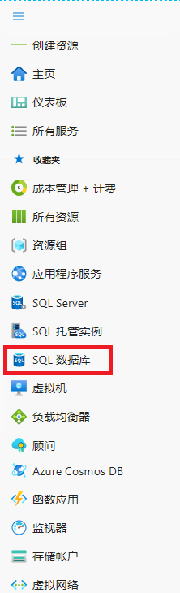
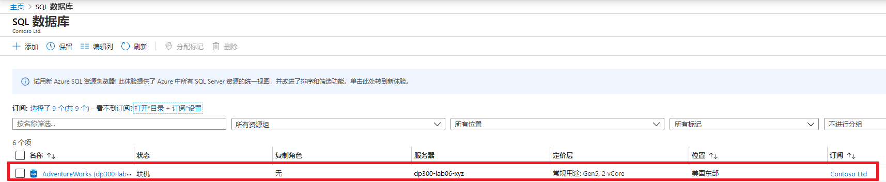
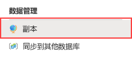
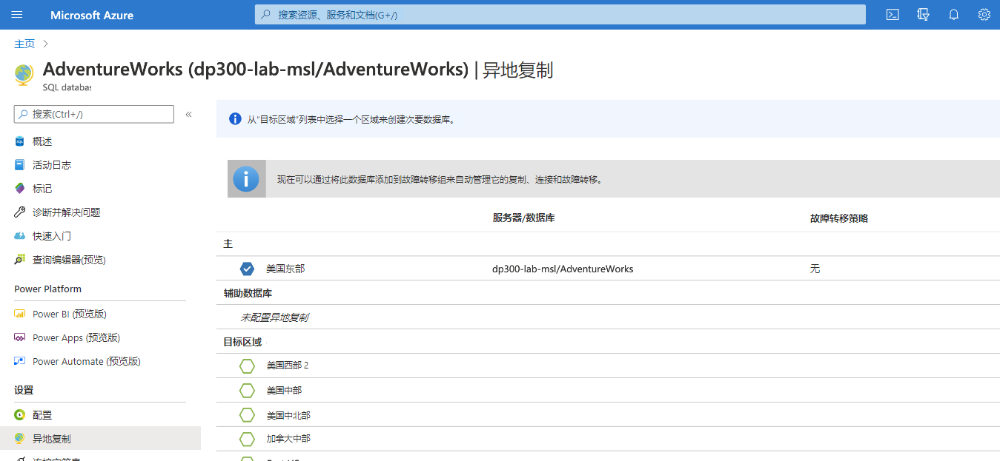
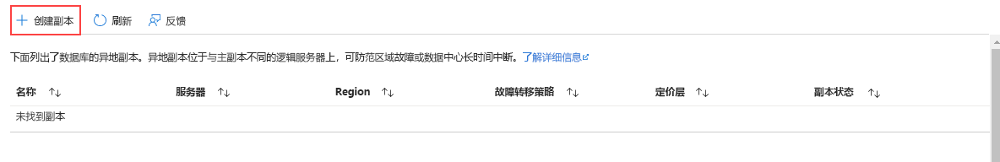
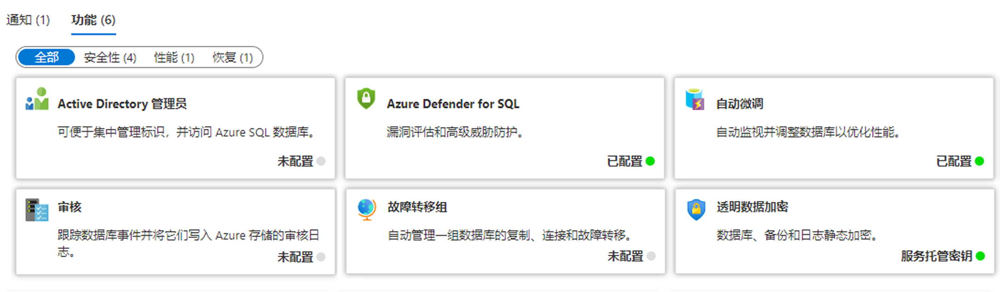
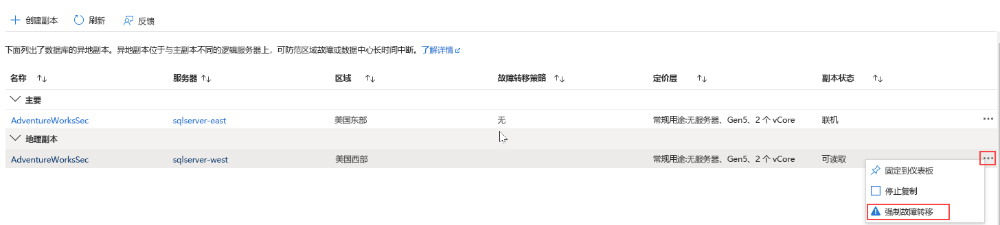
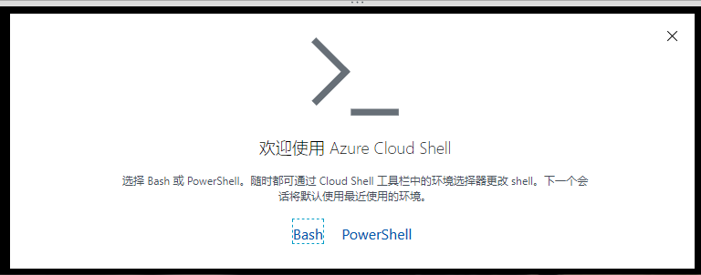
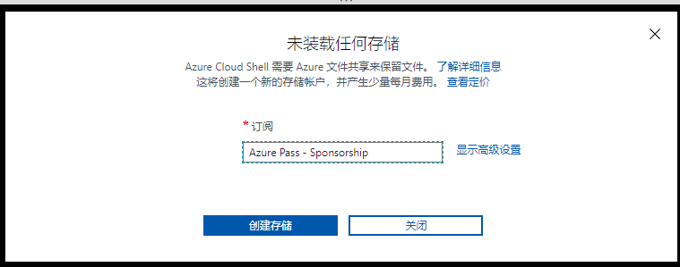
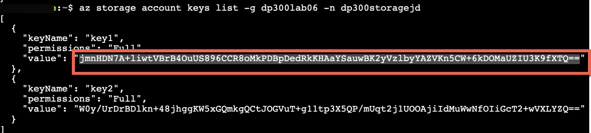

---
lab:
    title: '实验室 7 – 规划和实现高可用性和灾难恢复环境'
    module: '规划和实现高可用性和灾难恢复'
---

# 实验室 7 – 规划和实现高可用性和灾难恢复环境

**预计用时**： 90 分钟

**先决条件**： 练习 1 使用的 Azure SQL 数据库是在实验室中为模块 3 创建的。 

**实验室文件**： 本实验室的文件位于“D:\Labfiles\High Availability”文件夹中。

# 实验室概述

学生将执行两个主要任务：使 Azure SQL 数据库异地冗余，并备份到使用 Azure 的 URL 并从其中还原。 

# 实验室目标

完成本实验室后，你将能够：

- 为 Azure SQL 数据库启用异地复写

- 使用 URL 备份和还原 SQL Server 数据库


# 场景

作为高级数据工程师，你已经在上一个实验室中完成了日常的自动化任务，现在的任务是为数据库环境提升 IaaS 和 PaaS 配置的可用性。你的任务是实现以下目标：

- 为 Azure SQL 数据库启用异地复制，以提高数据库的可用性。

- 将数据库备份到 Azure 中的 URL，并在发生人为错误后将其还原。


# 练习 1：为 Azure SQL 数据库启用异地复制

预计用时：45 分钟

概述

学生们将修改在模块 3 的实验室中创建的 Azure SQL 数据库配置，以使其高度可用。

场景

作为 WideWorldImporters 中的 DBA，你需要知道如何为 Azure SQL 数据库启用异地复制，并确保其正常运行，并知道如何使用门户手动将其故障转移到另一个区域。

先决条件

- 为学生创建的 Azure 帐户 – 必须提供登录名（电子邮箱）和密码

- 预先创建的 Azure SQL Database 服务器和数据库

 

1. 如果未通过浏览器窗口登录 Azure 门户，请使用提供的 Azure 凭据进行登录。

2. 从菜单中选择 SQL 数据库，如下所示。

	

3. 单击在实验室 3 中创建的 Azure SQL 数据库。以下是一个示例。

	

 

4. 在数据库的边栏选项卡中，在“数据管理”下选择“复制”。 

	

	

5. 单击左上角的“创建复制”按钮。 

	

6. 在“**服务器**”下，选择“**新建**”。在“新建服务器”窗格中，输入唯一的服务器名称、有效的管理员登录名和安全密码，然后选择所选区域作为目标区域，然后单击“**确定**”创建服务器。

7. 返回“异地复制”边栏选项卡，单击“**查看 + 创建**”，然后单击“**创建**”。现在将创建辅助服务器和数据库。如要检查状态，请在门户顶部的铃铛图标下查看。如果成功，它将从进行中的部署升级到成功的部署。

	

8. 部署完成后，使用“**前往资源**”查看数据库的辅助异地复制，然后在“**概述**”页面底部的“**数据库功能**”部分，注意“**异地复制**”设置是否指示此数据库为辅助数据库。

	

9. 现在 Azure SQL 数据库已配置复制，可以执行故障转移。选择辅助服务器的“**异地复制**”页，并注意是否指示了主服务器和辅助服务器。

10. 选择辅助服务器的 **[...]** 菜单，然后单击“**强制故障转移**”。

	

11. 出现提示时，单击“**是**”。 

	主副本的状态将切换为“挂起”，而辅助副本的状态将切换为“故障转移”。此进程应该只需要几分钟。完成后，角色将切换，而辅助节点将变为新的主要节点，而旧的节点将成为辅助节点。

# 练习 2：备份到 URL 并从网址还原

预计用时：45 分钟

本练习的任务如下所示：

- 配置备份到 URL

- 备份 WideWorldImporters

- 还原 WideWorldImporters

## 任务 1：配置备份到 URL

在将 SQL Server 中的数据库备份到 Azure 之前，需要执行一些配置任务。 

**备注：** 有一些长字符串（包括存储帐户密钥和共享访问签名）会生成，然后进行重复使用。应考虑在实验室 VM 中打开一个记事本文件，以保存这些字符串。 

1. 验证你的上下文是否为 LON-SQL1 虚拟机。

2. 启动 Microsoft Edge 并登录到 Azure 门户 ([https://portal.azure.com](https://portal.azure.com/))，你已在该处则不必。

3. 选择下图右上角所示的图标，打开 Cloud Shell 提示。

	

4. 如果你尚未使用 Cloud Shell，则可能在门户的下半部分看到一条欢迎使用 Azure Cloud Shell 的消息。选择“Bash”。

	

5. 如果你以前没有使用过 Cloud Shell，则必须为其提供存储空间。在下面的对话框中单击“创建存储”。

	


6. 如果已经使用过 Cloud Shell，则只需确保 Cloud Shell 屏幕的左上角会显示 Bash。你可以使用下拉箭头选择 PowerShell 或 Bash。 
 

	完成后，你将看到类似于以下内容的提示。

	


7. 通过将以下命令复制到 Cloud Shell 中，从 CLI 创建存储帐户。

	```
	az storage account create -n dp300storage -g DP-300-Lab02 --kind StorageV2 -l eastus2
	```

	编辑该命令，使存储帐户名称唯一，其中所有字母均小写，并且不能包含特殊字符。你应该将上面的 *dp300storage* 更改为一个唯一的名称，例如 *dp300storagemsl123*。值 *DP-300-Lab02* 是现有资源组的名称。确保使用的数据库已在之前的实验室中创建。根据需要更改区域。按 Enter 运行该命令。 


	接下来，你将获得会在后续步骤中使用的帐户密钥。在进行编辑以使用与先前命令中相同的名称（在 -n 之后）和资源组（在 -g 之后）后，在 Cloud Shell 中运行以下代码。

	```
	az storage account keys list -g DP-300-Lab02 -n dp300storage
	```

	帐户密钥将出现在上述命令的结果中。确保复制 key1 的返回值（不带双引号），如下所示。可以将其保存在记事本中。 


	
 

8. 通过存储帐户和其内部所含的容器将 SQL Server 中的数据库备份到 URL。在此步骤中，你要创建专门用于备份存储的容器。为此，请执行以下命令，其中 *dp300storage* 是创建存储帐户时使用的存储帐户名称，而 *storage_key* 是上面生成的密钥。

	```
	az storage container create --name "backups" --account-name "dp300storage" --account-key "storage_key" --fail-on-exist
	```
 
	输出应返回 true。

	


9. 若要进一步验证是否已创建容器备份，请执行以下操作，其中 *dp300storage* 是你创建的存储帐户名，而 *storage_key* 是你在上面生成的密钥。 

	```
	az storage container list --account-name "dp300storage" --account-key "storage_key"
	```

	部分输出应返回与以下类似的内容。

	


10. 为了安全起见，容器级别需要使用共享访问签名 (SAS)。这可通过 Cloud Shell 或 PowerShell 生成。执行以下命令，其中 *dp300storage* 是你在上面创建的存储帐户名称，*storage_key* 是在上面生成的密钥，*date_in_the_future* 是晚于现在的时间。date_in_the_future 必须使用 UTC。例如 2020-10-31T00:00Z，应转换为 2020 年 10 月 31 日午夜到期：

	```
	az storage container generate-sas -n "backups" --account-name "dp300storage" --account-key "storage_key" --permissions "rwdl" --expiry "date_in_the_future" -o tsv
	```
	**备注：到期日的格式为“YYYY-MM-DD”，其中 YYYY 是四位数的年份，MM 是两位数的月份，DD 是两位数的日期。**

	输出应返回类似于以下值的内容，可在下一任务中使用。可以将该值以及之前保存的密钥复制并保存在记事本中。 

	


## 任务 2：备份 WideWorldImporters

现在该功能已配置，你可以在 Azure 中将备份文件生成为 Blob。 

1. 打开 SQL Server Management Studio，并确保已连接到 LON-SQL1。

2. 单击“新建查询”。

3. 使用以下 Transact-SQL 创建将用于访问云中存储的凭据。（如果凭证已经存在，请先将其删除。）填写适当的值，其中 *dp300storage* 是在任务 1 步骤 8 中创建的存储帐户名称，而 *sas_token* 是在任务 1 步骤 10 中生成的值（以 *se=...* 开头）。 

	```sql
	IF EXISTS 

	(SELECT * FROM sys.credentials 

	WHERE name = 'https://dp300storage.blob.core.windows.net/backups') 

	BEGIN
	
	    DROP CREDENTIAL [https://dp300storage.blob.core.windows.net/backups]
	    
	END
	
	GO


	CREATE CREDENTIAL [https://dp300storage.blob.core.windows.net/backups]

	WITH IDENTITY = 'SHARED ACCESS SIGNATURE',

	SECRET = 'sas_token'

	GO 
	```
	

4. 单击“**执行**”。应该是成功执行。

5. 在 Transact-SQL 中使用以下命令将数据库 WideWorldImporters 备份到 Azure，其中 *dp300storage* 是任务 1 中使用的存储帐户名称：

	```sql
	BACKUP DATABASE WideWorldImporters 

	TO URL = 'https://dp300storage.blob.core.windows.net/backups/WideWorldImporters.bak';

	GO 
	```

	这可能需要一些时间。若成功，应看到以下类似内容：

	已处理 1240 页的数据库“WideWorldImporters”，文件 1 上的文件“WWI_Primary”。

	已处理 53104 页数据库“WideWorldImporters”，文件 1 上的文件“WWI_UserData”。

	已处理 3865 页的数据库“WideWorldImporters”，文件 1 上的文件“WWI_InMemory_Data_1”。

	已处理 1468页的数据库“WideWorldImporters”，文件 1 上的文件“WWI_Log”。

	BACKUP DATABASE 在 14.839 秒内成功处理了 59677 页（31.419 MB/秒）。

	完成时间：2020-05-18T08:01:41.6935863+00:00

	

	如果一些配置错误，你将看到类似以下内容的错误消息：

	消息 3201，级别 16，状态 1，第 33 行  
	无法打开备份设备“https://dp300storage.blob.core.windows.net/container_name/WideWorldImporters.bak”。操作系统错误 50（不支持该请求）。  
	消息 3013，级别 16，状态 1，第 33 行  
	BACKUP DATABASE 异常终止。


	检查确认没有输错任何内容并成功创建所有内容。

6. 可以使用存储资源管理器或 Azure Cloud Shell 查看该文件是否确实位于 Azure 中。Bash 中的语法如下，其中 *dp300storage* 是任务 1 中使用的存储帐户名称，*account_key* 也是此处使用的密钥。 
	```
	az storage blob list -c "backups" --account-name "dp300storage" --account-key "storage_key"
	```
	
	示例输出如下所示。

	

 
## 任务 3：还原 WideWorldImporters

该任务为你展示如何还原数据库。


1. 在 SQL Server Management Studio 的“新建查询”窗口中，执行 
	```sql
	USE WideWorldImporters;
	GO
	
	```

2. 现在执行以下语句以返回 Customer 表的第一行，该表的 CustomerID 为 1。记下客户姓名。
	```sql
	SELECT TOP 1 * FROM Sales.Customers;
	GO
	
	```
	
3. 运行此命令以更改该客户名称。
	```sql
	UPDATE Sales.Customers
	SET CustomerName = 'This is a human error'
	WHERE CustomerID = 1;
	GO
	
	```

4. 重新运行步骤 2，以验证名称是否已更改。现在，假设有人在没有 WHERE 子句或错误 WHERE 子句的情况下更改了成千上万的行。

5. 要还原数据库以使其恢复到在步骤 3 中进行更改之前的状态，请关闭当前连接到 **WideWorldImporters** 数据库的所有查询，然后执行以下命令，其中 *dp300storage* 是任务 1 中使用的存储帐户名称。

	```sql
	USE master;
	GO

	RESTORE DATABASE WideWorldImporters 
	FROM URL = 'https://dp300storage.blob.core.windows.net/backups/WideWorldImporters.bak';
	GO
	```

	这可能需要一些时间。输出应如下所示：

	已处理 1240 页的数据库“WideWorldImporters”'，文件 1 上的文件“WWI_Primary”。

	已处理 53104 页数据库“WideWorldImporters”，文件 1 上的文件“WWI_UserData”。

	已处理 1468页的数据库“WideWorldImporters”，文件 1 上的文件“WWI_Log”。

	已处理 3865 页的数据库“WideWorldImporters”，文件 1 上的文件“WWI_InMemory_Data_1”。

	RESTORE DATABASE successfully processed 59677 pages in 16.167 seconds (28.838 MB/sec).

	完成时间：2020-05-18T08:35:06.6344123+00:00

6. WideWorldImporters 还原完成后，请重新运行第 1 步和第 2 步 。数据将返回原来的位置。
