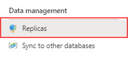
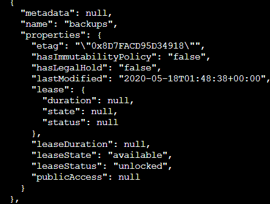

---
lab:
  title: 实验室 7 – 规划和实现高可用性和灾难恢复环境
  module: Planning and Implementing a High Availability and Disaster Recovery Environment
---

# <a name="lab-7--planning-and-implementing-a-high-availability-and-disaster-recovery-environment"></a>实验室 7 – 规划和实现高可用性和灾难恢复环境

预计用时：90 分钟

先决条件：练习 1 使用的 Azure SQL 数据库是在实验室中为模块 3 创建的。 

实验室文件：本实验室的文件位于“D:\Labfiles\High Availability”文件夹中。

# <a name="lab-overview"></a>实验室概述

学生将执行两个主要任务：使 Azure SQL 数据库异地冗余，并备份到使用 Azure 的 URL 并从其中还原。 

# <a name="lab-objectives"></a>实验室目标

完成本实验室后，你将能够：

- 为 Azure SQL 数据库启用异地复写

- 使用 URL 备份和还原 SQL Server 数据库


# <a name="scenario"></a>场景

作为高级数据工程师，你已经在上一个实验室中完成了日常的自动化任务，现在的任务是为数据库环境提升 IaaS 和 PaaS 配置的可用性。 你的任务是实现以下目标：

- 为 Azure SQL 数据库启用异地复制，以提高数据库的可用性。

- 将数据库备份到 Azure 中的 URL，并在发生人为错误后将其还原。


# <a name="exercise-1-enable-geo-replication-for-azure-sql-database"></a>练习 1：为 Azure SQL 数据库启用异地复制

预计时间：45 分钟

概述

学生们将修改在模块 3 的实验室中创建的 Azure SQL 数据库配置，以使其高度可用。

场景

作为 WideWorldImporters 中的 DBA，你需要知道如何为 Azure SQL 数据库启用异地复制，并确保其正常运行，并知道如何使用门户手动将其故障转移到另一个区域。

先决条件

- 为学生创建的 Azure 帐户 – 必须提供登录名（电子邮箱）和密码

- 预先创建的 Azure SQL Database 服务器和数据库

 

1. 如果未通过浏览器窗口登录 Azure 门户，请使用提供的 Azure 凭据进行登录。

2. 从菜单中选择 SQL 数据库，如下所示。

    

3. 单击在实验室 3 中创建的 Azure SQL 数据库。 下面显示了一个示例。

    

4. 在数据库的边栏选项卡中，在“数据管理”下选择“复制”。

    

5. 然后单击左上角的“创建复制”按钮。

    

6. 在“服务器”下，选择“新建” 。 在“新建服务器”窗格中，输入唯一的服务器名称、有效的管理员登录名和安全密码，然后选择所选区域作为目标区域，然后单击“确定”创建服务器。

7. 返回“异地复制”边栏选项卡，单击“查看 + 创建”，然后单击“创建” 。 现在会创建辅助服务器和数据库。 如要检查状态，请在门户顶部的铃铛图标下查看。 如果成功，则将从“正在进行部署”变为“部署已成功”。

8. 现在 Azure SQL 数据库已配置复制，可以执行故障转移。 选择辅助服务器的“副本”页后，可以看到指示了主服务器和辅助服务器。

9. 选择辅助服务器的“...”菜单，然后单击“强制故障转移” 。

    

10. 系统提示时，单击“是”****。 

    主要副本的状态将切换为“挂起”，次要副本的状态将切换为“故障转移”。 该过程将花费几分钟时间。 完成后，角色将切换，而辅助节点将变为新的主要节点，而旧的节点将成为辅助节点。

# <a name="exercise-2-backup-to-url-and-restore-from-url"></a>练习 2：备份到 URL 并从网址还原

预计时间：45 分钟

本练习的任务如下所示：

- 配置备份到 URL

- 备份 WideWorldImporters

- 还原 WideWorldImporters

## <a name="task-1-configure-backup-to-url"></a>任务 1：配置“备份到 URL”

在将 SQL Server 中的数据库备份到 Azure 之前，需要执行一些配置任务。 

**注意：** 有一些长字符串（包括存储帐户密钥和共享访问签名）会生成，然后被重复使用。 应考虑在实验室 VM 中打开一个记事本文件，以保存这些字符串。 

1. 验证你的上下文是否为 LON-SQL1 虚拟机。

2. 启动 Microsoft Edge 并登录到 Azure 门户 ([https://portal.azure.com](https://portal.azure.com/))，若你已在该处则不必。

3. 选择下图右上角所示的图标，打开 Cloud Shell 提示。

    

4. 如果你尚未使用 Cloud Shell，则可能在门户的下半部分看到一条欢迎使用 Azure Cloud Shell 的消息。 选择“Bash”。

    

5. 如果你以前没有使用过 Cloud Shell，则必须为其提供存储空间。 在下面的对话框中单击“创建存储”。

    


6. 如果已经使用过 Cloud Shell，则只需确保 Cloud Shell 屏幕的左上角会显示 Bash。 你可以使用下拉箭头选择 PowerShell 或 Bash。 
 

    完成后，你将看到类似于下图的提示符。

    


7. 通过将以下命令复制到 Cloud Shell 中，从 CLI 创建存储帐户。

    ```
    az storage account create -n dp300storage -g DP-300-Lab02 --kind StorageV2 -l eastus2
    ```

    编辑命令，以便存储帐户名称具有唯一性，其中所有字母均小写，并且不能包含特殊字符。 你应该将上面的 dp300storage 更改为一个唯一的名称，例如 dp300storagemsl123 。 值 DP-300-Lab02 是现有资源组的名称。 确保使用的数据库已在之前的实验室中创建。 如果需要，请更改区域。 按 Enter 以便运行该命令。 


    接下来获取帐户的帐户密钥，你在后续步骤中使用这些密钥。 在进行编辑以使用与先前命令中相同的名称（在 -n 之后）和资源组（在 -g 之后）后，在 Cloud Shell 中运行以下代码。

    ```
    az storage account keys list -g DP-300-Lab02 -n dp300storage
    ```

    帐户密钥就在上面的命令的结果中。 请务必复制 key1 的返回值（不带双引号），如下所示。 可以将其保存在记事本中。 


    
 

8. 将 SQL Server 中的数据库备份到 URL 时，使用存储帐户和其中的容器。 在这一步中，你将为备份存储专门创建一个容器。 为此，请执行以下命令，其中 dp300storage 是创建存储帐户时使用的存储帐户名称，而 storage_key 是上面生成的密钥 。

    ```
    az storage container create --name "backups" --account-name "dp300storage" --account-key "storage_key" --fail-on-exist
    ```
 
    输出应返回“true”。

    


9. 若要进一步验证是否已创建容器备份，请执行以下操作，其中 dp300storage 是你创建的存储帐户名，而 storage_key 是你在上面生成的密钥 。 

    ```
    az storage container list --account-name "dp300storage" --account-key "storage_key"
    ```

    部分输出应返回与以下类似的内容。

    


10. 为安全起见，需要容器级别的共享访问签名 (SAS)。 这可通过 Cloud Shell 或 PowerShell 生成。 执行以下命令，其中，dp300storage 是你在上面创建的存储帐户名称，storage_key 是在上面生成的密钥，date_in_the_future 是晚于此刻的时间  。 date_in_the_future 必须为协调世界时 (UTC)。 例如 2020-10-31T00:00Z，应转换为 2020 年 10 月 31 日午夜到期：

    ```
    az storage container generate-sas -n "backups" --account-name "dp300storage" --account-key "storage_key" --permissions "rwdl" --expiry "date_in_the_future" -o tsv
    ```
    **注意：到期日的格式为“YYYY-MM-DD”，其中 YYYY 是四位数的年份，MM 是两位数的月份，DD 是两位数的日期。**

    输出应返回类似于以下值的内容，可在下一任务中使用。 可以将该值以及之前保存的密钥复制并保存在记事本中。 

    


## <a name="task-2-back-up-wideworldimporters"></a>任务 2：备份 WideWorldImporters

现在功能已配置，你可以将备份文件生成为 Azure 中的 Blob。 

1. 打开 SQL Server Management Studio，并确保已连接到 LON-SQL1。

2. 单击“新建查询”。

3. 使用以下 Transact-SQL 语句创建将用于访问云中的存储的凭据。 （如果凭证已经存在，请先将其删除。）填写适当的值，其中 dp300storage 是在任务 1 步骤 8 中创建的存储帐户名称，而 sas_token 是在任务 1 步骤 10 中生成的值（以 se=... 开头）  。 

    ```sql
    IF EXISTS 

    (SELECT * FROM sys.credentials 

    WHERE name = 'https://dp300storage.blob.core.windows.net/backups') 

    BEGIN
    
        DROP CREDENTIAL [https://dp300storage.blob.core.windows.net/backups]
        
    END
    
    GO


    CREATE CREDENTIAL [https://dp300storage.blob.core.windows.net/backups]

    WITH IDENTITY = 'SHARED ACCESS SIGNATURE',

    SECRET = 'sas_token'

    GO 
    ```
    

4. 单击“执行” 。 应该是成功执行。

5. 在 Transact-SQL 中使用以下命令将数据库 WideWorldImporters 备份到 Azure，其中 dp300storage 是任务 1 中使用的存储帐户名称：

    ```sql
    BACKUP DATABASE WideWorldImporters 

    TO URL = 'https://dp300storage.blob.core.windows.net/backups/WideWorldImporters.bak';

    GO 
    ```

    这可能需要一些时间。 若成功，应看到以下类似内容：

    已处理 1240 页的数据库“WideWorldImporters”，文件 1 上的文件“WWI_Primary”。

    已处理 53104 页数据库“WideWorldImporters”，文件 1 上的文件“WWI_UserData”。

    已处理 3865 页的数据库“WideWorldImporters”，文件 1 上的文件“WWI_InMemory_Data_1”。

    已处理 1468页的数据库“WideWorldImporters”，文件 1 上的文件“WWI_Log”。

    BACKUP DATABASE 在 14.839 秒内成功处理了 59677 页（31.419 MB/秒）。

    完成时间：2020-05-18T08:01:41.6935863+00:00

    

    如果一些配置错误，你将看到类似以下内容的错误消息：

    消息 3201，级别 16，状态 1，第 33 行  
    ‎无法打开备份设备“https://dp300storage.blob.core.windows.net/container_name/WideWorldImporters.bak”。 操作系统错误 50（不支持该请求）。  
    消息 3013，级别 16，状态 1，第 33 行  
    BACKUP DATABASE 异常终止。


    检查确认没有输错任何内容并成功创建所有内容。

6. 可以使用存储资源管理器或 Azure Cloud Shell 查看该文件是否确实位于 Azure 中。 Bash 中的语法如下，其中 dp300storage 是任务 1 中使用的存储帐户名称，account_key 也是此处使用的密钥 。 
    ```
    az storage blob list -c "backups" --account-name "dp300storage" --account-key "storage_key"
    ```
    
    示例输出如下所示。

    

 
## <a name="task-3-restore-wideworldimporters"></a>任务 3：还原 WideWorldImporters

此任务展示如何还原数据库。


1. 在 SQL Server Management Studio 的“新建查询”窗口中，执行 
    ```sql
    USE WideWorldImporters;
    GO
    
    ```

2. 现在执行下面的语句，以返回 CustomerID 为 1 的客户表的第一行。 记下客户姓名。
    ```sql
    SELECT TOP 1 * FROM Sales.Customers;
    GO
    
    ```
    
3. 运行此命令更改该客户的名字。
    ```sql
    UPDATE Sales.Customers
    SET CustomerName = 'This is a human error'
    WHERE CustomerID = 1;
    GO
    
    ```

4. 重新运行步骤 2，验证名字是否已更改。 现在请设想，如果有人在没有 WHERE 子句或有错误 WHERE 子句的情况下更改了数千或数百万行。

5. 要还原数据库以使其恢复到在步骤 3 中进行更改之前的状态，请关闭当前连接到 WideWorldImporters 数据库的所有查询，然后执行以下命令，其中 dp300storage 是任务 1 中使用的存储帐户名称。

    ```sql
    USE master;
    GO

    RESTORE DATABASE WideWorldImporters 
    FROM URL = 'https://dp300storage.blob.core.windows.net/backups/WideWorldImporters.bak';
    GO
    ```

    这可能需要一些时间。 输出应如下所示：

    已处理 1240 页的数据库“WideWorldImporters”，文件 1 上的文件“WWI_Primary”。

    已处理 53104 页数据库“WideWorldImporters”，文件 1 上的文件“WWI_UserData”。

    已处理 1468页的数据库“WideWorldImporters”，文件 1 上的文件“WWI_Log”。

    已处理 3865 页的数据库“WideWorldImporters”，文件 1 上的文件“WWI_InMemory_Data_1”。

    RESTORE DATABASE successfully processed 59677 pages in 16.167 seconds (28.838 MB/sec).

    完成时间：5/18/2020 8:35:06 AM

6. WideWorldImporters 还原完成后，请重新运行第 1 步和第 2 步 。 数据将返回原来的内容。
